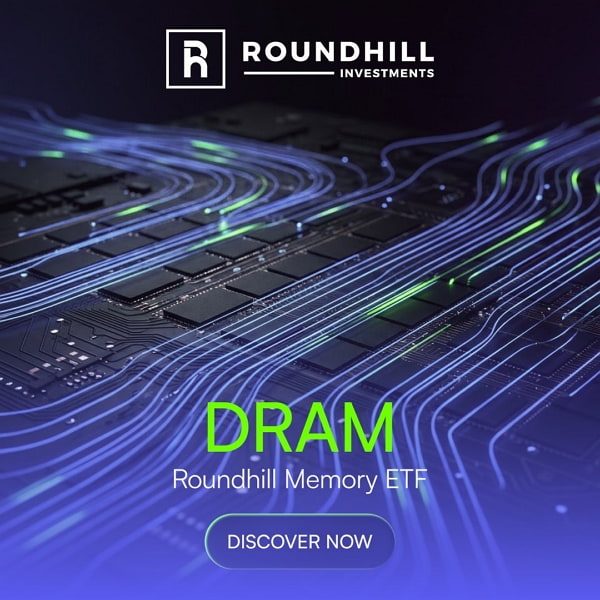
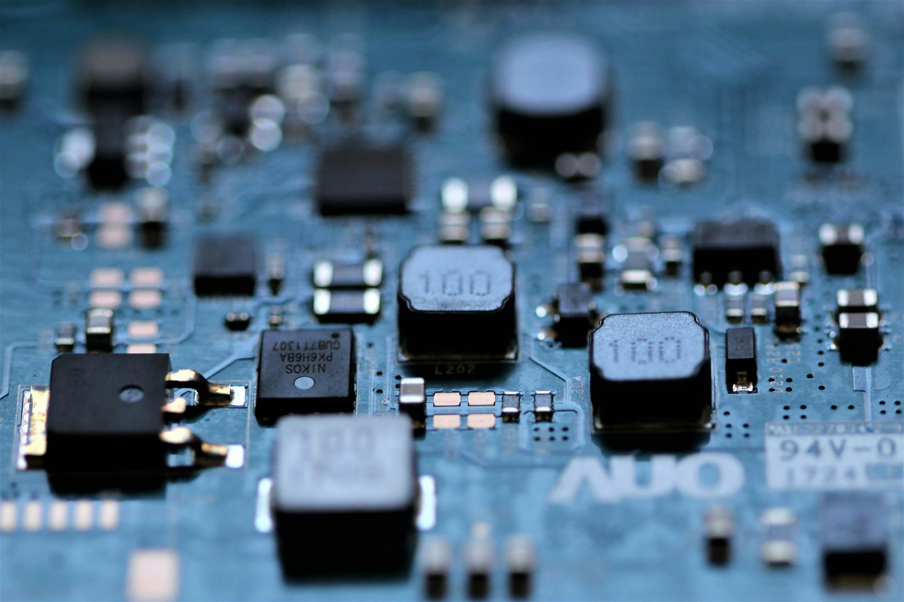

# 서학개미가 '삼전닉스 펀드'라 부르는 그 ETF — 'DRAM'의 정체

지난 4월 2일, 뉴욕증시에 ETF 하나가 새로 상장했다. 티커는 **DRAM**, 정식 명칭은 **라운드힐 메모리 ETF(Roundhill Memory ETF)**. 글로벌 최초로 메모리반도체 종목만을 모은 상품이다. 그런데 상장 두 달도 채 지나지 않아, 이 ETF는 한국 투자자들 사이에서 '삼전닉스 펀드'라는 별명으로 통하기 시작했다.

이유는 단순하다. 한국 종목 비중이 압도적이기 때문이다.

## 한 달 수익률 45%, 국내 반도체 ETF를 앞섰다

5월 29일 기준 DRAM ETF의 종목별 비중은 다음과 같다.

* 삼성전자: **27.23%**
* SK하이닉스: **18.12%**
* 마이크론: 5.27%
* 그 외: 키옥시아, 샌디스크, 시게이트 등

삼성전자와 SK하이닉스 두 종목만으로 펀드의 \*\*약 45%\*\*를 차지한다. 사실상 '미국에 상장된 한국 메모리 반도체 ETF'에 가깝다는 평가가 나오는 이유다.

성과도 만만치 않다. 상장 후 한 달간 수익률은 약 45%대. 같은 기간 국내 대표 반도체 ETF를 모두 앞섰다.

| ETF                 | 한 달 수익률 |
| ------------------- | ------- |
| DRAM (라운드힐 메모리 ETF) | 약 45%   |
| KODEX 반도체           | 40.04%  |
| TIGER 반도체TOP10      | 36.87%  |

## 서학개미 자금이 10%

상장 후 한 달간 DRAM ETF로 유입된 자금의 약 \*\*10%\*\*가 한국 개인 투자자(서학개미)에게서 들어왔다. 미국에 상장된 ETF에 특정 국가 개인 투자자 비중이 10%에 달하는 것은 결코 작은 수치가 아니다.

비중 구조를 보면 자연스러운 흐름이기도 하다. 평소 국내 거래량 1·2위인 삼성전자와 SK하이닉스를 한 번에 담을 수 있고, 거기에 마이크론과 글로벌 메모리 기업들이 함께 묶여 있는 구성이기 때문이다. 환헤지 부담 없이 메모리 사이클에 베팅하고 싶었던 서학개미들에게는 손에 익은 종목으로 만든 친숙한 바스켓인 셈이다.

## 다만, 이름값에 속지 말 것

이 ETF를 두고 '삼성·하이닉스·마이크론 ETF'라고 부르는 표현이 종종 보이는데, 여기엔 한 가지 주의가 필요하다.

**마이크론 비중이 생각보다 작다.** 5.27%에 그치고, 시점에 따라 2.5%까지 내려간 집계도 있다. 삼성·하이닉스와 동급으로 묶기에는 무리가 있고, 실제 위치는 키옥시아·샌디스크·시게이트와 비슷한 '그 외' 그룹에 가깝다.

정확히 표현하자면 DRAM ETF는 **삼성과 하이닉스가 절반을 차지하는 미국 상장 메모리 ETF**다. 마이크론도 들어 있긴 하지만, 펀드의 색깔을 결정하는 종목은 아니다.

또 하나, 일각에서 "5월 서학개미 순매수 1위"라는 표현이 보이는데, '자금 유입 비중'과 '순매수 순위'는 다른 지표다. 유입 비중이 높았던 것은 분명하지만, 5월 전체 순매수 1위 여부는 별도 데이터 확인이 필요하다.

## 정리하면

* DRAM ETF는 2026년 4월 2일 NYSE 상장, 글로벌 최초의 메모리반도체 전용 ETF
* 사실상 삼성전자·SK하이닉스가 펀드의 절반을 차지하는 구조
* 상장 첫 달 수익률 45%로 국내 반도체 ETF를 앞섬
* 유입 자금의 약 10%가 서학개미 — '삼전닉스 펀드'로 통하는 이유

미국에서 한국 반도체에 베팅하는 가장 효율적인 통로 중 하나가 됐다는 점은 분명하다. 다만 '메모리 ETF'라는 이름과 '삼성·하이닉스·마이크론' 같은 동급 묶음 표현에는 약간 거리를 두고 보는 편이 정확하다.

---

*본 글은 투자 권유 목적이 아니며, 비중·수익률 등 수치는 2026년 5월 29일 기준 자료를 바탕으로 함.*
