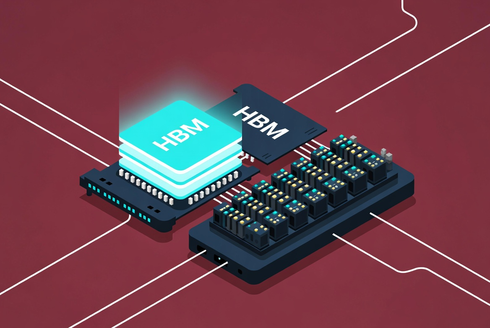
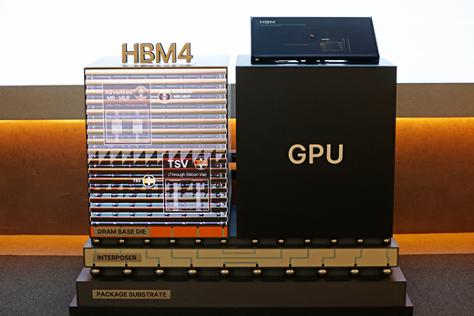

# 55TB가 28TB로? 엔비디아 SOCAMM 루머가 삼성·하이닉스를 흔든 진짜 이유

> "엔비디아 차세대 AI 서버의 메모리가 절반으로 줄어든다."
>
> 이 한 줄짜리 루머에 6월 5일 코스피가 흔들렸습니다. 삼성전자는 7% 넘게, SK하이닉스는 9% 넘게 빠졌고, 미국에서는 마이크론이 약 10% 폭락했습니다. 그런데 이상한 점이 있습니다. **같은 날 젠슨 황 CEO는 한국에 와서 "HBM 더 많이 만들어달라"고 적고 있었거든요.** 도대체 무슨 일이 벌어진 걸까요?

이 글에서는 이번 사태의 진짜 정체인 **SOCAMM**이 무엇인지, HBM과 어떻게 다른지, 그리고 왜 시장이 과민 반응했는지를 처음부터 풀어보겠습니다. 반도체를 잘 모르는 분도 끝까지 읽을 수 있도록 비유를 충분히 섞겠습니다.

---

## 1. 무슨 일이 벌어졌나 — 팩트부터 정리

6월 4일, 반도체 분야에서 가장 영향력 있는 독립 리서치 회사 **SemiAnalysis**가 한 장의 모닝 브리프를 발표했습니다. 내용을 한 문장으로 줄이면 이렇습니다.

> "엔비디아의 차세대 AI 서버 랙 **루빈 NVL72**에 들어갈 시스템 메모리 용량이 랙당 약 **55TB에서 28TB로 줄어들 수 있다**."

기존 시장 전망은 **192GB짜리 SOCAMM 모듈**을 가득 채워 출하한다는 것이었는데, 실제로는 **96GB SOCAMM**으로 다운그레이드된다는 분석이 나온 겁니다.

뉴욕 증시는 바로 반응했습니다. 마이크론이 약 10% 폭락했고, 샌디스크는 11%, 웨스턴디지털과 시게이트까지 동반 하락했습니다. 다음 날 한국 증시도 직격탄을 맞았습니다. 삼성전자 7%↓, SK하이닉스 9%↓. AI 사이클의 핵심 수혜주들이 하루 만에 시가총액 수십조 원을 날렸습니다.

**쉽게 비유하자면 이렇습니다.** "한 컴퓨터에 32GB 램을 꽂으려 했는데 막판에 16GB로 바꾼다는 소문"이 메모리 회사들 사이에 돈 셈입니다. 다만 이건 가정용 PC가 아니라 한 대에 수십억 원짜리 AI 슈퍼컴퓨터고, 전 세계에 수만 대가 깔릴 물건이라 파장이 큰 겁니다.

> 📌 **한 줄 요약:** SemiAnalysis 리포트 한 장에 한미 메모리주가 동반 급락했다. 진짜 원인은 'SOCAMM 용량 반토막' 루머다.

---

## 2. 도대체 SOCAMM이 뭔데?

이름부터 풀어봅시다. **SOCAMM**은 **S**mall **O**utline **C**ompression **A**ttached **M**emory **M**odule의 약자입니다. 한 줄로 정의하면 이렇습니다.

> **AI 서버용으로 새로 만든, 저전력·고용량·교체 가능한 메모리 모듈.**

원래 스마트폰에 쓰던 **LPDDR(저전력 D램)** 기술을 서버용으로 재설계한 것이 SOCAMM입니다. 기존 서버용 메모리(RDIMM) 대비 **대역폭이 2배 이상**, **에너지 효율은 75% 이상** 좋아졌습니다. 게다가 모듈형이라 나사로 끼웠다 뺐다 할 수 있어서, 데이터센터가 업그레이드하기에도 편합니다. SOCAMM2는 이를 한 단계 더 발전시킨 2세대 규격입니다.

**왜 이런 게 필요했을까요?**

스마트폰을 떠올려 보세요. 전기를 적게 먹는 메모리(LPDDR)를 쓰는 이유는 명확합니다. 충전 한 번에 하루 종일 가야 하니까요. AI 서버는 24시간 풀가동인데, 그 전기료가 정말 어마어마합니다. 데이터센터 운영자에게 전력 비용과 발열은 가장 큰 골칫거리입니다.

여기서 누군가 이런 생각을 한 거죠. "스마트폰 메모리를 서버에도 써볼까? 전기 덜 먹으면서 용량도 크게 만들 수 있잖아." 그 결과물이 SOCAMM입니다.

특히 AI 시장이 **'학습'에서 '추론(서비스)'으로 무게중심이 옮겨가면서** 전력 효율은 그 어떤 스펙보다 중요해졌습니다. 학습은 한 번 잘 시키면 끝이지만, 추론은 사용자가 쓰는 내내 전기를 먹습니다. 엔비디아가 차세대 플랫폼 \*\*베라 루빈(Vera Rubin)\*\*의 표준 메모리로 SOCAMM2를 채택한 이유가 여기 있습니다.

> 📌 **한 줄 요약:** SOCAMM은 '스마트폰의 절전 기술'을 'AI 서버의 거대한 용량'에 접목한 신형 메모리 모듈이다.

---

## 3. HBM과 SOCAMM, 헷갈리지 말자 ⭐

이 글에서 가장 중요한 부분입니다. 이번 사태를 이해하는 열쇠가 \*\*"무엇이 줄었느냐"\*\*에 있기 때문이죠.

| 구분           | **HBM (HBM4)**          | **SOCAMM (SOCAMM2)**        |
| ------------ | ----------------------- | --------------------------- |
| 위치           | **GPU 옆**에 딱 붙음         | **CPU 옆** 슬롯에 꽂힘            |
| 역할           | AI 연산용 초고속 메모리          | 시스템 운영용 메모리                 |
| 속도           | 압도적으로 빠름                | HBM보다 느림 (대신 용량 큼)          |
| 가격           | 매우 비쌈 (수익성 ⬆)           | 상대적으로 저렴                    |
| 형태           | 칩에 직접 적층 (분리 불가)        | 모듈형 (꽂았다 뺐다 가능)             |
| 루빈 NVL72 탑재량 | 랙당 약 **20.7TB** ✅ 변동 없음 | 랙당 **55TB → 28TB** ⚠️ 축소 루머 |
| 이번 루머와 관계    | **무관함**                 | **이게 핵심**                   |

머리에 더 잘 박히도록 비유를 하나 들어보겠습니다.

**AI 슈퍼컴퓨터 한 대를 '레스토랑 주방'으로 생각해 봅시다.**

* **HBM**은 셰프(GPU) 바로 옆 **도마와 작업대**입니다. 칼질하고 볶고, 1초도 손에서 떨어지면 안 되는 재료들이 올라가는 곳이죠. 가장 비싸고, 가장 빠르고, 셰프 바로 옆에 붙어 있습니다.
* **SOCAMM**은 주방 뒤편의 **대형 냉장고와 식자재 창고**입니다. 당장 쓸 건 아니지만, 영업 내내 필요한 재료가 잔뜩 들어가 있어요. 셰프가 직접 가는 게 아니라 보조(CPU)가 가지러 가는 곳입니다.

자, 그럼 이번 루머의 정체가 보입니다. **"셰프 도마(HBM)를 줄인다"가 아니라 "식자재 창고(SOCAMM)를 절반 크기로 줄인다"는 이야기입니다.** 도마는 그대로예요. 셰프의 칼질 실력(AI 성능)은 변함이 없습니다.

그런데 왜 시장이 그토록 놀랐을까요? SOCAMM이 차세대 메모리 시장의 새 격전지로 떠오르고 있었고, 이미 많은 투자자가 'SOCAMM 폭증 시나리오'에 베팅하고 있었기 때문입니다. 그 시나리오의 숫자가 절반으로 깎이는 그림이 그려진 거죠.

> 📌 **한 줄 요약:** 줄어든 건 '식자재 창고(SOCAMM)'지 '셰프의 도마(HBM)'가 아니다. AI 성능에는 영향이 없다.

---

## 4. 왜 엔비디아는 메모리를 줄이려 할까?

여기서 두 가지 해석이 부딪힙니다.

**시나리오 A: 수요가 줄어서? ❌**

시장의 첫 반응이었습니다. "AI 거품이 꺼지는 거 아냐?" 하는 공포가 메모리주를 쳤죠. 그런데 이 해석은 한 가지 사실과 맞지 않습니다. 바로 **HBM4 탑재량은 그대로**라는 점입니다. 수요가 진짜 식는 거라면 HBM도 같이 줄였어야 합니다.

**시나리오 B: 더 많이 팔기 위해서? ✅**

SemiAnalysis 자체 분석은 이쪽에 가깝습니다. SOCAMM 축소로 랙당 비용이 약 **760만 달러 → 680만 달러**로 떨어진다는 계산이 나옵니다. SOCAMM 공급이 부족한 상황에서, 랙 1대당 메모리를 줄여서 **더 많은 랙을 출하**하겠다는 의도라는 거죠. 시간당·GPU당 총소유비용(TCO)이 개선되니까 고객도 더 사기 쉬워집니다.

**빵집 비유로 풀어보면 이렇습니다.**

어떤 빵집이 식빵 한 봉지에 12쪽을 넣고 1만 원에 팔려고 했어요. 그런데 밀가루가 부족해서 12쪽으로는 100봉지밖에 못 만듭니다. "그럼 한 봉지에 6쪽씩만 넣고 7천 원에 팔자. 그러면 200봉지를 만들 수 있어." 결과는 이렇게 됩니다.

* 한 봉지당 매출은 줄어요 (악재)
* 그런데 총 판매 봉지는 2배가 됩니다 (호재)
* 손님(데이터센터)도 더 싸게 살 수 있어 만족

엔비디아의 SOCAMM 축소가 이 빵집 시나리오에 가깝다는 게 전문가들의 해석입니다. 강력한 근거가 또 있습니다. **같은 날 젠슨 황은 한국에서 SK하이닉스 부스에 "Please Make More(더 많이 만들어달라)"라고 적었고**, SOCAMM 부스에는 "LOVE SOCAMM"이라고 적었습니다. 수요가 식는 사람의 행보가 아닙니다.

> 📌 **한 줄 요약:** 메모리를 줄이는 건 'AI 수요가 식어서'가 아니라 '더 많은 랙을 더 빨리 팔기 위해서'에 가깝다.

---

## 5. SOCAMM은 누가 만들까? — 메모리 3대장 3파전

다음 차세대 메모리 전쟁이 펼쳐지는 무대가 바로 여기입니다. HBM에서 시작된 3사 경쟁이 SOCAMM으로 이어집니다.

### 🥇 SK하이닉스

2026년 4월 20일, **10나노급 6세대(1c) 공정** 기반 **192GB SOCAMM2 본격 양산**을 시작했습니다. 엔비디아 베라 루빈에 **최적화된 업계 최초 모듈**이라고 공식 발표했죠. 기존 RDIMM 대비 대역폭 2배 이상, 에너지 효율 75% 이상 개선이라는 스펙을 내세웠습니다. 김주선 AI 인프라 사장은 "AI 메모리 성능의 새로운 기준을 수립했다"고 자신감을 드러냈습니다. HBM 시장 1위의 신뢰를 SOCAMM에서도 그대로 이어가려는 전략입니다.

### 🥈 삼성전자

SK하이닉스보다 한 발 앞서 **10나노급 5세대(1b) 공정**으로 192GB SOCAMM2를 업계 최초 양산했습니다. SOCAMM2의 최대 난제였던 **휨(warpage) 현상**을 자체 저온 솔더(LTS) 기술로 해결했고, 솔더링 공정 온도를 기존 260°C에서 150°C 이하로 낮춘 게 결정적이었습니다. 업계 추산 \*\*엔비디아향 SOCAMM2 출하량의 약 50%\*\*를 삼성이 담당할 전망입니다. HBM4·HBM4E·SOCAMM2까지 풀라인업을 갖춘 게 가장 큰 강점이죠.

### 🥉 마이크론

작년 SOCAMM 1세대에서는 거의 **독점**에 가까웠습니다. 선점 효과가 컸죠. 2026년 3월에는 삼성·SK보다 33% 큰 **256GB SOCAMM2 샘플**을 출하하며 용량 승부수를 던졌습니다. 다만 SOCAMM2 전환 시점에 한국 업체들에 추격당하는 모양새입니다. 이번 루머에 가장 크게 흔들린 종목이 마이크론(약 10%↓)이었던 이유도 SOCAMM 매출 비중이 가장 컸기 때문입니다.

메리츠증권의 한 줄 분석이 이 그림을 잘 요약합니다. "올해는 마이크론 독점에 가까웠지만, 내년 물량은 국내 공급사 위주로 재구성될 가능성이 크다." HBM 경쟁의 2라운드가 SOCAMM에서 펼쳐지는 셈입니다.

> 📌 **한 줄 요약:** HBM 1위 SK하이닉스, 공정 최선두 삼성, 선점 효과의 마이크론. 3사 전쟁의 무대가 옮겨가고 있다.

---

## 6. 진짜 악재일까, 단기 노이즈일까?

투자자라면 양면을 다 봐야 합니다.

**악재로 볼 만한 점 (Bear case)**

192GB가 96GB가 된다면 메모리 비트(bit) 수요는 명백히 줄어듭니다. 랙당 SOCAMM 매출 자체가 감소하고, 시장이 기대했던 SOCAMM TAM(잠재 시장 규모)도 하향 조정이 불가피합니다. 특히 매출에서 SOCAMM 비중이 큰 마이크론은 직격탄을 맞을 수 있습니다.

**호재로 볼 여지도 충분 (Bull case)**

가장 중요한 건 **HBM4 수요는 그대로**라는 사실입니다. 엔비디아 AI 매출의 핵심 동력은 무사하다는 뜻이죠. 랙당 비용이 내려가면 더 많은 랙이 출하되니, 총 메모리 수요는 의외로 덜 줄 수도 있습니다. SOCAMM은 모듈형이라 마이크로소프트·구글·메타 같은 하이퍼스케일러는 **여전히 192GB 풀구성**을 선택할 수 있다는 점도 변수입니다. 프리미엄 옵션은 살아 있는 거죠. 옵티컬 인터커넥트나 SSD 공급사(키오시아·코닝 등)는 오히려 수혜를 볼 가능성도 있습니다.

그리고 잊지 말아야 할 사실. **이건 엔비디아 공식 발표가 아니라 공급망 리포트 기반 루머입니다.** SemiAnalysis가 영향력 있는 곳이긴 하지만, 100% 확정은 아닙니다. 진짜 영향은 2026년 하반기 루빈이 본격 출하될 때 확인 가능합니다.

> 📌 **한 줄 요약:** SOCAMM 매출 둔화는 사실. 하지만 HBM은 무사하고, 루빈 출하가 늘면 총수요는 보전될 수 있다.

---

## 7. 투자자가 봐야 할 5가지 체크포인트

뉴스에 휘둘리지 않으려면 앞으로 이런 신호들을 추적해야 합니다.

1. **엔비디아 공식 발표** — CES, GTC 등에서 루빈 NVL72 사양이 확정 발표되는 시점.
2. **HBM4 수율** — 진짜 핵심은 여전히 HBM4. SK하이닉스·삼성·마이크론의 양산 및 납품 추이.
3. **하이퍼스케일러 주문 패턴** — MS·구글·아마존이 192GB 풀구성을 선택할지, 96GB로 갈지.
4. **SOCAMM 단가 추이** — 용량이 줄어도 단가가 오르면 매출 영향은 제한적.
5. **루빈 출하 속도** — 랙 수가 늘어나면 총 메모리 수요는 보전될 수 있다.

이 다섯 가지가 메모리 사이클의 진짜 방향을 가늠하는 나침반입니다.

---

## 마무리: 공포의 정체

6월 5일 메모리주 폭락의 진짜 원인은 \*\*"메모리가 안 팔린다"가 아니라 "엔비디아가 한 랙에 들어가는 메모리를 줄여 더 많은 랙을 빨리 출하하려 한다"\*\*는 공급망 이슈였습니다. 그것도 GPU 옆 HBM이 아니라, CPU 옆 SOCAMM 이야기죠.

HBM4 수요는 여전히 강하고, 젠슨 황은 같은 날 SK하이닉스에 "더 많이 만들어달라"고 적고 있었습니다. 단기 변동성은 피할 수 없지만, AI 메모리 사이클의 큰 그림이 바뀐 건 아닙니다. 다만 SOCAMM에 베팅했던 투자자라면 **단가·물량·점유율 3박자**를 모두 다시 점검할 시점입니다.

루머 한 줄에 시장이 크게 흔들리는 건, 그만큼 이 사이클이 뜨겁다는 증거이기도 합니다. 흔들림 속에서 무엇이 변했고 무엇이 그대로인지를 구분하는 눈, 그게 투자자에게 가장 필요한 능력 아닐까요.

---

> **🔑 한 줄로 외우기** *"이번 루머의 메시지는 'AI 수요가 줄었다'가 아니라 '엔비디아가 더 많이, 더 빨리 팔고 싶어 한다'에 가깝다."*
