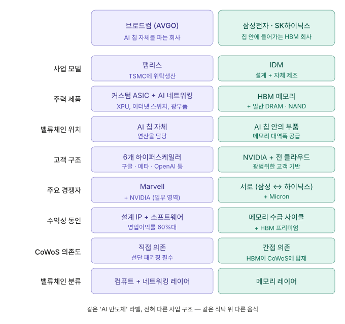
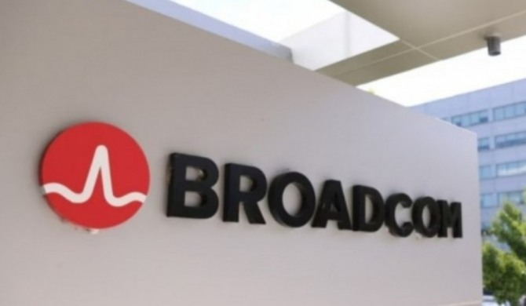

# 브로드컴은 비즈니스가 완전히 다른데, 왜 삼성·하이닉스가 같이 빠졌을까

### — 브로드컴 쇼크가 코스피 사이드카를 발동시킨 진짜 이유

> **한 줄 요약** 브로드컴(커스텀 ASIC·AI 네트워킹)과 삼성전자·SK하이닉스(HBM 메모리)는 사업 구조가 전혀 다릅니다. 그런데도 시장이 'AI 반도체 묶음'으로 거래하기 때문에 동조화 매도가 일어났습니다. 이번 급락은 펀더멘털 충격이 아니라 'AI 기대치 천장' 충격으로 봐야 합니다.

---

## 1. 오늘 한국 시장에서 무슨 일이 있었나

2026년 6월 5일 오전 9시 8분, 한국거래소는 **코스피에 매도 사이드카를 발동**했습니다. 올해 코스피에서 울린 21번째 사이드카이자, 매도 사이드카로는 10번째였습니다.

코스피는 장 초반 510포인트(-5.91%)나 빠지며 8,129p까지 내려갔고, 코스닥은 3개월 만에 1,000선이 무너졌습니다. 시가총액 상위 종목은 대부분 동반 급락이었습니다.

* **SK하이닉스**: 장 초반 -9%대까지 급락 (오전 한때 207만 7,000원), 사이드카 시점 -7.57% — 212만 원대
* **삼성전자**: -5.69% → -6.4%대 (33만 1,500원 → 33만 250원)
* **삼성물산**: -12\~14%대
* **SK스퀘어**: -8\~9%대
* **삼성전기**: -5.19%

특히 흥미로운 건 어제(6월 4일)는 비교적 차분했다는 점입니다. 삼성전자 -1.25%, SK하이닉스 -2.58% 수준이었죠. 그런데 오늘 아침 한국 시장이 열리자마자 외국인 매도가 쏟아지며 사이드카 수준의 급락이 나왔습니다.

**무슨 일이 있었느냐 — 트리거는 단 하나, 브로드컴(AVGO) 실적이었습니다.**

전날 미국 현지 장 마감 후 발표된 브로드컴의 2026 회계연도 2분기 실적이 시간외에서 -12%를 만들었고, 다음 날 정규장에서 결국 **-14.44%로 마감**했습니다. 그 충격이 시차를 두고 한국 시장을 강타한 거죠.

그런데 여기서 이 글의 핵심 질문이 등장합니다.

> **브로드컴은 GPU나 HBM을 만들지 않습니다. 삼성·하이닉스와 사업 구조가 전혀 다른 회사입니다. 그런데 왜 같이 빠졌을까요?**

이 질문에 답하려면 먼저 브로드컴 실적이 정말로 나빴는지부터 다시 봐야 합니다.

---

## 2. 브로드컴 실적은 정말 나빴나? — 숫자로 다시 보기

결론부터 말하면, **브로드컴의 분기 실적 자체는 시장 기대를 모두 웃돌았습니다**. 어닝 비트입니다. 그런데도 -14%가 나왔습니다. 왜일까요? 가이던스와 장기 목표가 시장 기대보다 살짝 약했기 때문입니다.

숫자로 정리하면 다음과 같습니다.

| 지표            | 브로드컴 Q2 FY26 실제    | 시장 기대             | 결과        |
| ------------- | ------------------ | ----------------- | --------- |
| 총매출           | $22.19B (+48% YoY) | $22.13B           | **비트**    |
| Non-GAAP EPS  | $2.44              | $2.40             | **비트**    |
| AI 반도체 매출     | $10.8B (+143% YoY) | 자체 가이던스 $10.7B 상회 | **비트**    |
| 영업이익률         | 67% (사상 최대)        | —                 | **기록 경신** |
| Q3 AI 매출 가이던스 | $16.0B (+200% YoY) | $16.36B           | **소폭 미스** |
| FY27 AI 매출 목표 | $100B 유지 (상향 안 함)  | 상향 기대             | **미스**    |

> 회계연도 기준: 브로드컴의 회계연도는 11월 종료 기준이라 'Q2 FY26'은 2026년 5월 3일에 끝난 분기를 의미합니다.

핵심 포인트를 하나씩 풀어보겠습니다.

### 2-1. 매출과 이익은 사상 최대치

**총매출 $22.19B(약 30조 원)는 전년 동기 대비 +48% 성장**한 수치이며, 이 중 반도체 매출이 $15B(+79% YoY)였습니다. 그리고 그 반도체 매출의 핵심 동력인 **AI 반도체 매출은 $10.8B로 전년 대비 +143% 폭증**했습니다.

영업이익률은 67%로 사상 최대치를 갈아치웠고, 잉여현금흐름은 $10.3B(매출의 46%)에 달했습니다. **펀더멘털 수치만 보면 이건 명백히 호실적입니다.**

### 2-2. 더 놀라운 건 'AI 주문잔량'

호크 탄 CEO가 컨퍼런스콜에서 언급한 한 줄짜리 디테일이 있습니다.

> "이번 분기 AI 반도체 **신규 수주(bookings)는 300억 달러를 넘었습니다.** 실제 출하한 108억 달러의 세 배에 가까운 수치입니다."

즉, **수요는 공급보다 훨씬 빠르게 늘고 있다**는 의미입니다. 'AI 수요 둔화'와는 정반대 신호죠. 그래서 하나증권 김록호 연구원도 이번 조정을 "AI 수요 둔화가 아닌 시장 기대치 조정"으로 해석했습니다.

### 2-3. 그런데 왜 -14%가 나왔나?

문제는 **두 가지 가이던스**였습니다.

**첫 번째**, Q3 AI 매출 가이던스 $16.0B이 시장이 기대한 $16.36B(약 24조 원)을 소폭 밑돌았다는 것. +200% YoY 성장률에도 불구하고 시장은 그 이상을 기대하고 있었습니다.

**두 번째**, 그리고 이게 진짜 결정타였습니다. 호크 탄 CEO가 **2027 회계연도 AI 매출 1,000억 달러 목표를 그대로 유지하고 상향하지 않았다**는 점입니다. 시장은 이 정도 분기 성장세라면 당연히 상향이 나올 거라고 기대하고 있었거든요.

이 두 가지가 합쳐지면서 시장은 "최고의 분기 실적을 내고도 미래 기대치를 못 끌어올리는 회사"라는 해석을 내렸습니다. 펀더멘털이 무너진 게 아니라, **AI 랠리에 누적된 프리미엄이 얼마나 두꺼웠는지가 확인된** 사건인 거죠.

> **핵심**: 브로드컴 쇼크는 *실적 충격*이 아니라 *기대치 충격*입니다. 이 구분이 오늘 한국 시장을 이해하는 출발점입니다.

---

## 3. ⭐ 브로드컴 vs 삼성·하이닉스 — 사업 구조가 완전히 다릅니다

자, 이제 이 글의 진짜 차별점입니다.

많은 투자자들이 무심코 "AI 반도체주가 다 같이 빠졌다"고 말합니다. 그런데 **브로드컴과 삼성·하이닉스는 같은 'AI 반도체' 라벨을 달고 있을 뿐, 사실상 완전히 다른 사업을 합니다.**

어제 \[AI 반도체 4단 밸류체인] 글에서 정리한 4개 레이어 프레임을 다시 떠올려 봅시다.

> Layer 1. GPU / AI 가속기 Layer 2. **HBM 메모리** ← 삼성·하이닉스 무대 Layer 3. **네트워킹 + 커스텀 ASIC** ← 브로드컴 무대 Layer 4. 서버 + 패키징

두 회사는 **다른 층에서 다른 고객에게 다른 제품을 팝니다.** 표로 정리해 보겠습니다.

| 구분                 | 브로드컴 (AVGO)                               | 삼성전자·SK하이닉스                        |
| ------------------ | ----------------------------------------- | ---------------------------------- |
| **사업 모델**          | 팹리스 설계 (TSMC 위탁생산)                        | IDM (설계 + 자체 제조 통합)                |
| **주력 제품**          | 커스텀 ASIC(XPU), AI 이더넷 스위치, 광 인터커넥트        | HBM(고대역폭 메모리), 일반 DRAM, NAND       |
| **밸류체인 위치**        | AI 칩 **그 자체** (연산을 담당)                    | AI 칩 **안에 들어가는 부품** (메모리)          |
| **고객 구조**          | 6개 하이퍼스케일러에 집중 (구글·메타·OpenAI·Anthropic 등) | NVIDIA(최대 고객), 모든 하이퍼스케일러, 클라우드 전반 |
| **주요 경쟁자**         | Marvell, NVIDIA(부분 영역)                    | 서로(삼성↔하이닉스), Micron                |
| **수익성 동인**         | 설계 IP + 소프트웨어(VMware) → 영업이익률 60%대        | 메모리 수급 사이클 + HBM 프리미엄              |
| **TSMC CoWoS 의존도** | 직접 의존 (선단 패키징 필요)                         | 간접 (HBM이 CoWoS 안에 탑재되는 형태)         |
| **밸류체인 분류**        | 컴퓨트 + 네트워킹 레이어                            | 메모리 레이어                            |

### 3-1. 브로드컴은 어떤 회사인가

브로드컴을 한 줄로 표현하면 이렇습니다.

> **"AI 데이터센터 1달러의 약 30%를 가져가는 커스텀 칩 + 네트워킹 회사."**

엔비디아처럼 모든 고객에게 같은 GPU를 파는 게 아니라, **구글에는 구글용 TPU, 메타에는 메타용 MTIA, OpenAI에는 OpenAI용 가속기**를 각각 맞춤 설계해 줍니다. 칩 자체는 TSMC에 위탁 생산하고, 브로드컴은 설계 IP와 라우팅, 네트워킹 기술을 제공합니다.

또 하나, AI 데이터센터에 들어가는 **이더넷 스위치(Tomahawk 시리즈)와 광 트랜시버**도 브로드컴이 사실상 표준입니다. 수만 개의 GPU를 묶는 '고속도로'에 해당하는 영역이죠.

이런 사업 구조 덕분에 \*\*영업이익률 67%, 잉여현금흐름률 46%\*\*라는 메모리 업체와는 차원이 다른 수익성이 나옵니다.

### 3-2. 삼성·하이닉스는 어떤 회사인가

반대로 삼성·하이닉스는 **HBM(고대역폭 메모리)**, 그리고 일반 DRAM·NAND를 자체 팹에서 직접 설계·제조·판매합니다. AI 시대의 핵심은 GPU가 아무리 빨라도 데이터가 제때 도착하지 않으면 놀고 있다는 사실 — 즉 **메모리 대역폭이 진짜 병목**이라는 점이고, 그 병목을 푸는 회사가 바로 이 두 곳입니다.

NVIDIA, AMD, 그리고 **브로드컴이 설계한 커스텀 ASIC에도** HBM이 탑재됩니다. 즉 삼성·하이닉스는 *브로드컴의 경쟁자가 아니라, 일부 사업에서는 공급자에 가까운* 포지션입니다.

### 3-3. 한 줄로 정리하면

> **브로드컴은 'AI 칩 자체를 파는 회사', 삼성·하이닉스는 '그 칩 안에 들어가는 HBM을 파는 회사'.**
>
> **둘은 같은 식탁 위 다른 음식이지, 같은 음식이 아닙니다.**

그렇다면 다시 처음의 질문으로 돌아가야 합니다. **그런데 왜 같이 빠졌을까요?**

---

## 4. 그런데 왜 같이 빠졌을까 — 4가지 연결 고리

사업 구조는 분명히 다른데, 시장은 이들을 같은 묶음으로 다룹니다. 여기엔 4가지 이유가 있습니다.

### 4-1. 하이퍼스케일러 CapEx라는 공통 수도꼭지

브로드컴 매출의 절대 다수, 그리고 삼성·하이닉스 HBM 매출의 핵심이 모두 **6개 하이퍼스케일러(구글, 메타, MS, 아마존, 오픈AI/오라클 컨소시엄, X-AI)의 데이터센터 투자**에서 나옵니다.

이들이 돈을 덜 쓰면 → 브로드컴 커스텀 ASIC 주문도 줄고, 동시에 HBM 주문도 줄어듭니다. 그래서 시장은 **브로드컴 가이던스 = 하이퍼스케일러 CapEx 둔화 시그널**로 즉시 해석합니다.

이번에 브로드컴이 FY27 AI 매출 1,000억 달러 목표를 상향하지 않자, 시장은 "하이퍼스케일러가 이 정도까지만 쓰겠다는 거 아니야?"라는 의심을 품기 시작한 거죠. 그 의심이 SK하이닉스·삼성전자에 그대로 전이됐습니다.

### 4-2. AI 센티먼트 동조화 — "AI 묶음 거래"

이게 어쩌면 더 중요한 이유입니다. \*\*글로벌 펀드들은 NVIDIA, AVGO, AMD, MU(마이크론), SK하이닉스, 삼성전자를 '하나의 AI 바스켓'\*\*으로 들고 있습니다.

미국 반도체 ETF인 **SOXX, SMH**는 이 종목들을 한꺼번에 담고 있고, 헤지펀드의 'AI 익스포저' 포지션도 마찬가지입니다. 한 종목이 빠지면 → 바스켓 전체의 위험 익스포저가 늘어남 → 자동 리밸런싱 → **바스켓 내 모든 종목 매도**가 일어납니다.

특히 외국인은 한국 시장에서 삼성·하이닉스를 'AI 익스포저 한국 대리물'로 보유하는 경우가 많기 때문에, 미국에서 AVGO가 무너지면 → 한국에서 두 종목이 1차로 매도되는 구조가 만들어집니다.

> **참고**: 오늘 코스닥 시장에서도 외국인이 1,135억 원 순매도, 코스피에서는 외국인 매도세가 사이드카까지 만들어냈습니다. 이건 한국 기업 펀더멘털과는 무관한 '바스켓 리밸런싱'의 결과입니다.

### 4-3. 삼성전자는 브로드컴의 직접 HBM 협력사

조금 더 미시적인 연결도 있습니다.

로이터 등의 보도에 따르면, **삼성전자는 NVIDIA뿐 아니라 브로드컴과도 맞춤형 HBM4 공급을 협의 중**입니다. 즉 브로드컴 ASIC이 잘 팔려야 → 그 안에 들어갈 HBM도 잘 팔리는 직접적인 사업 연결이 일부 있습니다.

브로드컴 가이던스가 약하다 = 브로드컴 ASIC 출하가 시장 기대보다 덜 늘어난다 = 거기에 탑재될 삼성 HBM4 수요도 기대보다 덜할 수 있다. 이런 식의 직접 영향이 일부 가격에 반영됐을 수 있습니다.

다만 이건 *부분적* 영향입니다. SK하이닉스는 여전히 NVIDIA 블랙웰·루빈 라인에 HBM3E/HBM4를 거의 독점 공급하고 있고, 이 부분은 브로드컴 실적과 직접 관련이 없습니다.

### 4-4. 외국인 자금의 'AI 반도체 → 신흥국 반도체' 회전

마지막으로 매크로 자금 흐름의 문제입니다. 미국 AI 반도체에 리스크 신호가 켜지면 → 글로벌 펀드는 **위험 자산 비중을 줄이는 1단계로 신흥국 반도체 비중부터 축소**합니다. 한국 시장의 외국인 매도가 미국 AI 종목 변동성에 가장 민감하게 반응하는 이유입니다.

오늘 매도 사이드카가 발동한 것도, 결국 외국인 매도 + 프로그램 매도가 동시에 쏟아진 결과입니다.

---

## 5. 그렇다면 오늘 급락은 어떻게 봐야 하나 — 투자자가 진짜로 봐야 할 4가지 체크포인트

이제 본격적으로 투자자 관점에서 짚어봐야 할 4가지 질문이 있습니다.

### 체크포인트 ①: AI 수요 자체가 꺾인 건가?

**답: No.**

* 브로드컴 Q3 AI 매출 가이던스 +200% YoY는 여전히 폭발적 성장입니다.
* AI 주문잔량(bookings) $30B+가 출하($10.8B)의 약 3배에 달합니다. 수요는 공급을 한참 앞서고 있습니다.
* 하이퍼스케일러 6사의 2026년 CapEx 가이던스는 여전히 사상 최대치를 유지 중입니다.

### 체크포인트 ②: 기대치가 너무 높았던 건가?

**답: Yes. 이게 본질입니다.**

* 브로드컴 주가는 1년 전 대비 두 배 이상 올랐던 상황이었습니다.
* 분기마다 가이던스를 깨고 또 상향하는 사이클이 4번 이상 반복되면서, 시장은 '이번에도 상향이 나올 것'을 기본값으로 가격에 반영해 두고 있었습니다.
* 호크 탄 CEO가 그 사이클을 한 번 끊은 것이 -14%의 진짜 원인입니다.

### 체크포인트 ③: HBM 공급 경쟁 구도가 흔들렸나?

**답: No.**

* SK하이닉스: NVIDIA HBM3E 12단·HBM4 점유율 우위 유지.
* 삼성전자: HBM3E 퀄 통과, HBM4로 반격 중.
* 마이크론: 추격자 포지션, 한국 2사 우위 변화 없음.

브로드컴 가이던스 약화가 HBM 시장의 한국 2사 구도를 흔드는 건 아닙니다. AI 학습용 칩이 NVIDIA든 브로드컴 ASIC이든, **HBM은 그 위에 거의 무조건 탑재**되기 때문입니다.

### 체크포인트 ④: 단기 차익실현 매물이 섞여 있나?

**답: 부분적으로 Yes.**

* 어제(6/4) 한국 시장은 젠슨 황 방한 효과로 삼성전자가 +10%대 급등하며 시총 2,000조 원을 돌파한 상태였습니다.
* 즉 직전 거래일 단기 급등 부담이 누적되어 있던 종목들이, 브로드컴 쇼크라는 트리거를 만나 차익실현 매도가 함께 터졌습니다.
* 삼성물산 -13%, SK스퀘어 -9%대는 사실상 직전 급등분의 되돌림 성격이 큽니다.

---

## 6. 결론: 이번 급락을 어떻게 받아들여야 하나

지금까지 내용을 다 묶어보면 다음 세 줄로 정리됩니다.

> **첫째.** 브로드컴 쇼크는 펀더멘털 충격이 아니라 기대치 충격입니다. **둘째.** 삼성·하이닉스 급락은 사업 구조의 직접 타격이 아니라 센티먼트 동조화의 결과입니다. **셋째.** 하지만 시장이 이들을 한 묶음으로 거래하는 한, 미국 AI 종목의 변동성은 앞으로도 한국 반도체 시장에 그대로 전달될 것입니다.

이 세 가지는 한국 반도체 투자자에게 한 가지 중요한 인식 전환을 요구합니다.

### 인식 전환: '엔비디아·브로드컴 어닝 캘린더'가 코스피 일정만큼 중요해졌다

지금까지 한국 반도체 투자자들이 챙기던 일정은 다음과 같았습니다.

* 삼성전자 분기 실적
* SK하이닉스 분기 실적
* DRAM/NAND 가격 동향 (디램익스체인지)
* 한국 수출 데이터

이제 여기에 **다음 일정을 같은 비중으로 추가해야 합니다.**

* **NVIDIA 실적** (한국 메모리주의 진정한 선행지표)
* **브로드컴 실적** (하이퍼스케일러 CapEx 시그널)
* **TSMC 월간 매출·분기 실적** (CoWoS 캐파 = HBM 수요)
* **하이퍼스케일러 4사(MS, 구글, 메타, 아마존) CapEx 가이던스**

이번처럼 미국 종목의 가이던스 한 줄이 한국 시가총액 1·2위 종목의 시총을 수십조 원씩 흔드는 일은 일회성이 아닙니다. 시장 구조가 이미 그렇게 짜여 있고, 앞으로 더 강해질 가능성이 큽니다.

### 그래서 오늘 행동 가능한 한 가지

오늘 같은 날 가장 위험한 의사 결정은 두 가지입니다.

1. **공포에 휩쓸려 무조건 매도** — 펀더멘털 변화 없이 센티먼트로만 빠진 자리에서 던지는 것
2. **반등 기대만으로 무조건 매수** — 글로벌 AI 바스켓 추가 조정 가능성을 무시하는 것

대신 권하고 싶은 건 이겁니다.

> **"오늘 내 보유 종목이 빠진 이유가, 그 회사의 펀더멘털이 흔들렸기 때문인지, 아니면 시장이 같은 묶음으로 묶고 있어서인지 한 번씩 분리해 보기."**

만약 후자라면 — 즉 사업 구조와 무관하게 'AI 묶음 거래'에 휩쓸린 자리라면 — 그건 적어도 *기업 가치 훼손 신호*는 아닙니다. 다음 어닝 시즌까지의 변동성을 견딜 자신만 있다면, 오히려 차분히 들고 가는 선택이 합리적일 수 있습니다.

반대로 사업 구조가 흔들리는 신호라면 — 예를 들어 HBM 공급 구도가 깨진다거나, NVIDIA 차기 가이던스가 정말로 약해진다거나 — 그땐 진지하게 재평가가 필요합니다. 오늘 그런 신호는 아직 없습니다.

---

## 7. 마지막 정리 — 이번 사건이 남긴 3가지 교훈

이번 브로드컴 쇼크가 한국 반도체 시장에 남긴 메시지를 세 줄로 압축하면 이렇습니다.

1. **AI 반도체는 한 묶음이 아니다.** GPU·HBM·커스텀 ASIC·네트워킹은 같은 산업이 아니라 4개의 다른 산업입니다. (어제 \[AI 반도체 4단 밸류체인] 글의 핵심이 여기서 한 번 더 증명됐습니다.)
2. **그런데 시장은 한 묶음으로 거래한다.** 사업 구조의 차이를 시장 가격이 인정해 주려면 시간이 더 필요합니다. 그때까지는 외국인 자금이 미국 AI 종목 변동성을 한국 시장에 그대로 흘려보낼 것입니다.
3. **지금은 'AI 기대치의 천장'을 확인하는 단계.** AI 수요 자체가 꺾인 건 아니지만, 시장 기대치가 너무 높았던 자리들이 한 번씩 정상화되는 시기입니다. 펀더멘털과 센티먼트를 분리해서 보는 능력이 어느 때보다 중요해졌습니다.

다음에 또 한 번 미국 AI 종목 어닝 이후 코스피가 급락하는 날이 온다면, 오늘 글의 이 한 줄만 떠올려 주세요.

> **"이번에 빠진 건 펀더멘털일까, 아니면 기대치일까?"**

이 질문 하나가 무릎에서 사고, 어깨에서 파는 평범한 투자자와, 무릎에서도 떨지 않는 투자자를 가릅니다.

---

### 함께 읽으면 좋은 글

> 📌 \[AI 반도체 4단 밸류체인 — 엔비디아 1달러, 한국엔 얼마가 떨어지나] AI 인프라에 들어가는 1달러가 GPU → HBM → 네트워킹 → 서버·패키징 네 개 층으로 어떻게 흘러가는지, 한국 종목 중심으로 분해한 글입니다. 오늘 본문의 '구조적 차이' 섹션은 이 시리즈의 후속편입니다.

---

> *본 콘텐츠는 정보 제공 목적의 교육 자료이며, 특정 종목에 대한 매수·매도 추천이나 투자 자문이 아닙니다. 모든 투자 결정과 그 결과에 대한 책임은 투자자 본인에게 있습니다.*

---

##
