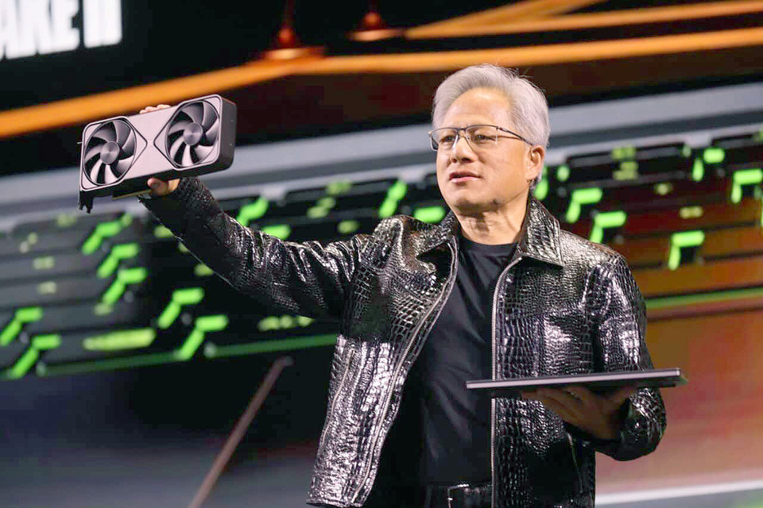
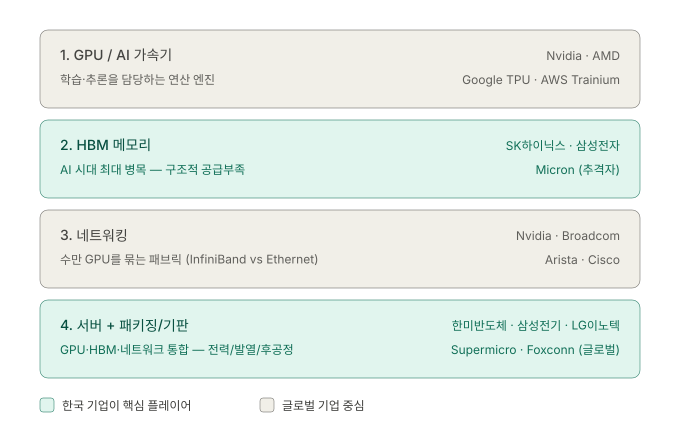
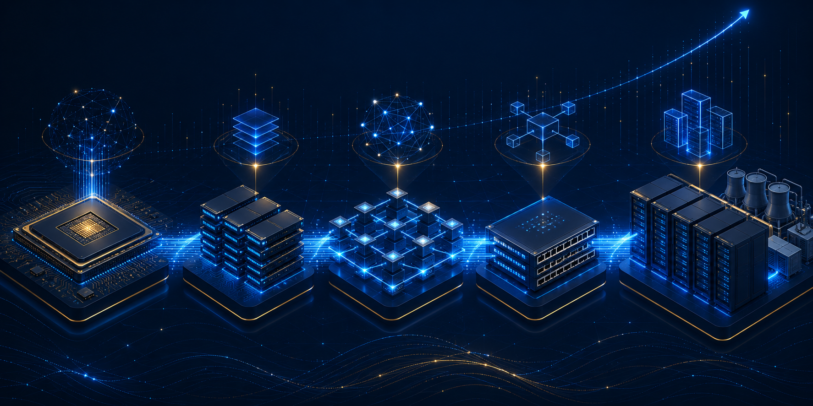

# AI 반도체, 엔비디아 한 종목으로 끝나지 않습니다

### — AI 인프라 1달러의 흐름을 4단으로 풀어드립니다

---

## 1. 왜 젠슨 황은 한국에서 저녁을 먹었을까

지난 주, 흥미로운 장면이 하나 있었습니다.

젠슨 황 엔비디아 CEO가 **GTC 타이베이 2026** 기조연설을 마치고 곧장 한국으로 건너왔습니다. '코리아 파트너 나이트'라는 이름의 자리에 **삼성전자, SK하이닉스, 현대차그룹, LG전자, 두산, 네이버** 같은 한국 대표 기업이 한자리에 모였죠.

여기서 자연스럽게 떠오르는 질문이 있습니다.

> **왜 엔비디아 CEO가 한국 기업들을 한자리에 모았을까?**

답은 의외로 단순합니다. AI 가속기의 경쟁력이 더 이상 'GPU 한 칩'에서 끝나지 않기 때문입니다. **메모리 대역폭, 전력 효율, 첨단 패키징, 데이터센터 운영까지** — AI 인프라는 이미 여러 층이 톱니바퀴처럼 맞물려 돌아가는 시스템이 됐고, 그 핵심 부품의 상당수가 한국 기업의 손에 있습니다.

그래서 오늘은 흔히 통하는 'AI 투자 = 엔비디아'라는 등식을 잠시 옆에 내려놓고, **AI 인프라에 들어가는 1달러가 실제로 어디로 흐르는지** 4개 층으로 분해해 보겠습니다.

---

## 2. 큰 그림: AI 서버는 거대한 '공장 단지'다

기술 용어를 본격적으로 다루기 전에, 머릿속에 그림 하나만 그려놓고 가겠습니다.

AI 서버 한 대를 **거대한 공장 단지**라고 생각해 봅시다.

* **GPU**는 실제로 일을 하는 ⟶ **공장 본체**
* **HBM**은 본체에 원료를 끊임없이 실어 나르는 ⟶ **고속 컨베이어 벨트**
* **네트워킹**은 여러 공장을 하나의 거대한 산업단지로 묶는 ⟶ **고속도로망**
* **서버 + 패키징**은 공장 자체의 ⟶ **건물·전기 설비·조립 공정**

이 네 가지 중 **하나라도 빠지면 AI 서버는 작동하지 않습니다**. 그리고 각 층마다 돈을 가져가는 회사가 다릅니다. 위 도식에서 **녹색(teal) 두 줄에 한국 기업이 핵심 플레이어로 자리잡고 있다**는 점이 오늘 콘텐츠의 출발점입니다.

이제 한 층씩 내려가 봅시다.

---

## 3. Layer 1. GPU / AI 가속기 — '공장 본체'

GPU(Graphics Processing Unit)는 원래 게임 화면을 빠르게 그리기 위한 칩이었습니다. 그런데 AI 모델 학습에 필요한 계산이 게임 그래픽 처리와 구조가 매우 비슷하다는 점이 밝혀지면서, 어느덧 **AI 시대의 가장 비싼 부품**이 됐습니다.

이 층의 선수들은 비교적 단순합니다.

* **엔비디아**: Blackwell(B200, GB200) 시리즈, 차세대 Rubin. 거의 모든 헤드라인을 가져가는 절대 강자.
* **AMD**: MI300X, MI350. 추격자.
* **커스텀 ASIC**: 구글(TPU), AWS(Trainium), 마이크로소프트(Maia), 메타(MTIA) 등 빅테크가 자체 설계한 AI 전용 칩.

### 한국 투자자에게 의미하는 것

이 층에 직접 투자할 한국 종목은 거의 없습니다. 하지만 **엔비디아의 분기 실적과 가이던스는 한국 종목의 가장 중요한 선행지표**입니다. GPU가 더 많이 팔린다는 건 곧 HBM과 후공정 장비가 더 많이 필요하다는 뜻이니까요. 엔비디아 실적 발표일은 SK하이닉스와 삼성전자에게도 사실상 'D-1'이라고 보면 됩니다.

---

## 4. Layer 2. HBM 메모리 — 한국 투자자의 메인 무대

HBM(High Bandwidth Memory, 고대역폭 메모리)은 한마디로 **GPU 옆에 딱 붙어 있는 초고속 메모리**입니다.

왜 중요할까요? AI 모델 학습은 거대한 양의 데이터를 끊임없이 GPU에 부어넣어야 하는데, **일반 메모리(DDR)로는 속도가 한참 모자랍니다**. GPU가 아무리 빨라도 데이터가 제때 도착하지 않으면 GPU가 그냥 놀고 있게 되죠. 그래서 AI 시대의 진짜 병목은 *연산 속도*가 아니라 **메모리 대역폭**으로 옮겨갔습니다.

이 시장은 사실상 **3사 과점** 구도입니다.

* **SK하이닉스**: HBM3E 12단으로 엔비디아 메인 공급. HBM4 양산 선두 주자. 용인 1기 팹 조기 가동으로 캐파 선점 작업 중.
* **삼성전자**: HBM3E 퀄(품질 인증) 통과. 엔비디아·브로드컴 등과 맞춤형 HBM4 공급 협의 진행.
* **마이크론(미국)**: 추격자 포지션.

수급도 한국에 우호적입니다. 업계 전망에 따르면 **2026년 D램 수요는 30% 이상, 서버용 D램은 40%대 성장**이 예상되는 반면 공급은 20% 수준에 그칠 가능성이 큽니다. 이런 구조적 공급 부족이 가격결정권을 메모리 업체에게 넘겨주는 그림입니다.

### 한국 투자자에게 의미하는 것

**HBM 가격, 수율, 신제품 뉴스 = SK하이닉스·삼성전자 실적 모멘텀**입니다. 분기 컨퍼런스콜에서 'HBM 비중'과 'HBM4 양산 일정'이 어떻게 언급되는지가 가장 중요한 체크 포인트입니다.

---

## 5. Layer 3. 네트워킹 — 수만 개의 GPU를 묶는 '고속도로'

요즘 데이터센터는 GPU 한두 개로 끝나지 않습니다. **수만 개, 많게는 수십만 개의 GPU를 하나의 거대한 클러스터로 묶어서** 사용합니다. 칩과 칩 사이를 연결해 주는 통신망이 바로 **네트워킹**입니다.

GPU 1개의 성능이 아무리 좋아도 연결이 시원찮으면 전체 클러스터 성능이 무너집니다. **결국 'GPU 성능 × 효율적 연결'의 곱**으로 데이터센터의 진짜 실력이 결정되는 셈이죠.

이 시장은 두 진영으로 나뉘어 있습니다.

* **인피니밴드(InfiniBand) 진영**: 엔비디아가 멜라녹스 인수로 확보한 폐쇄형 규격. 지연 시간이 매우 짧음.
* **이더넷(Ethernet) 진영**: 브로드컴 + 아리스타 + 시스코. 2025년 6월 발표된 **UEC(Ultra Ethernet Consortium) 1.0**은 기존 이더넷의 단순 개선이 아니라 AI 클러스터에 맞춰 전(全) 레이어를 재설계한 규격입니다.

흐름은 이더넷이 우세해지는 추세입니다. AI 백엔드 스위치 포트에서 이더넷이 이미 과반을 가져갔고, 시장은 70\~80%까지 향하는 모양새입니다. 다만 엔비디아의 **Spectrum-X** 데이터센터 스위치 플랫폼이 전년 동기 대비 760% 이상 성장하며 14.6억 달러 매출을 기록, 만만치 않은 반격을 하고 있다는 점도 함께 기억해 두는 게 좋습니다.

### 한국 투자자에게 의미하는 것

직접 종목은 적습니다. 다만 **고속 통신에 필요한 광트랜시버, 고속 커넥터, 전력반도체** 같은 보조 부품에서 한국 협력사들의 수혜 여지가 있습니다(오이솔루션·라이콤·아이엠 등). 이 부분은 한 편의 콘텐츠로 따로 다룰 만한 깊이가 있어 다음 시리즈에서 별도로 정리하겠습니다.

---

## 6. Layer 4. 서버 + 패키징/기판 — 한국의 두 번째 무대

GPU, HBM, 네트워킹을 모두 합쳐서 **한 박스에 넣고, 전력과 발열까지 책임지는 단계**입니다. 의외로 이 단계에서도 큰 병목이 생깁니다.

특히 **CoWoS**(Chip on Wafer on Substrate, TSMC의 첨단 패키징 공법)는 HBM과 GPU를 한 패키지로 묶는 핵심 기술인데, **TSMC는 2026년 말까지 CoWoS 생산능력을 월 12.5만 장까지 늘릴 계획이지만, 그중 약 60%는 이미 엔비디아가 독점 예약**한 상태입니다. 즉, 후공정 캐파 자체가 곧 AI 가속기 공급량의 상한선을 결정하는 구조죠.

이 층에서 빛나는 한국 기업들이 있습니다.

* **한미반도체**: HBM 후공정의 핵심 장비인 **TC 본더**의 사실상 글로벌 표준. HBM4 공정에 'TC 본더 4'가 핵심 장비로 투입되고 있으며, 차세대 HBM5·6를 겨냥한 '와이드 TC 본더'를 올해 하반기 출시 예정.
* **삼성전기 · LG이노텍**: 스마트폰 부품 의존도가 컸던 두 회사가 \*\*고부가 반도체 기판(FC-BGA)\*\*을 앞세워 AI 서버 밸류체인 진입에 속도를 내는 중.

글로벌에서는 슈퍼마이크로·델·HPE, 그리고 ODM인 폭스콘·콴타·위스트론이 서버 본체를 조립합니다.

### 한국 투자자에게 의미하는 것

HBM이 '메모리 칩 자체'라면, **한미반도체와 기판주는 HBM을 GPU에 붙이는 도구·기판** 자리입니다. HBM 캐파가 늘어날수록 후공정 캐파도 같이 늘어야 하기 때문에, **수요 곡선이 HBM과 비슷한 모양**으로 따라옵니다. 즉, HBM 빅사이클을 믿는다면 이 층도 함께 보고 있어야 한다는 뜻입니다.

---

## 7. 한국 투자자가 들고 가야 할 3가지 매핑 룰

오늘 내용을 실전에서 바로 쓸 수 있도록 짧은 룰 3개로 정리하겠습니다.

**① GPU 뉴스(엔비디아·AMD 실적·가이던스) → SK하이닉스·삼성전자 출하량 선행지표로 해석** 엔비디아 다음 분기 가이던스가 올라가면, 한국 메모리의 출하량도 시간차를 두고 따라오를 확률이 높습니다.

**② HBM 가격·수율·신제품 뉴스 → 한미반도체 + 기판주(삼성전기·LG이노텍) 동반 체크** HBM이 늘어나는 만큼 그걸 붙이는 장비와 기판도 같이 늘어납니다. 한쪽만 보면 그림이 절반입니다.

**③ 네트워킹·이더넷 뉴스(브로드컴·아리스타) → 광부품/고속 커넥터 한국 협력사 확인** 직접 대형주는 적지만, 시장 흐름이 이더넷으로 가는지 인피니밴드로 가는지에 따라 수혜 종목군이 달라집니다.

---

## 8. 마무리: 다음 'AI 급등' 기사를 만났을 때

다음에 'AI 반도체 급등' 헤드라인을 보게 되면, 클릭하기 전에 딱 한 가지만 스스로 물어보세요.

> **"이번에 움직인 건 4개 층 중 어디지?"**

* GPU가 움직였다 → 한국 메모리에 **시간차 수혜** 신호
* HBM이 움직였다 → 후공정 장비·기판이 **동반 움직일 가능성**
* 패키징이 움직였다 → HBM **다음 사이클을 미리 알리는 신호**

이 하나의 해석 프레임만 가지고 있어도, 같은 기사를 봐도 결이 다르게 읽힙니다.

**오늘 장 마감 후 짧은 실습 하나**: 보유 중이거나 관심 있는 종목이 위 4개 층 중 어디에 속하는지 한 줄로 적어보세요. 어디에도 속하지 않는다면, 왜 그 종목을 'AI 수혜주'라고 부르는지 한 번 더 점검해 볼 시간입니다.

### 다음 편 예고

다음 콘텐츠에서는 **'한국 AI 후공정 밸류체인'** 을 다룰 예정입니다. CoWoS · TC본더 · 하이브리드본더 · FC-BGA를 한국 종목 중심으로 더 깊이 풀어볼 계획입니다.

---

> *본 콘텐츠는 투자 정보 제공 목적의 교육 자료이며, 특정 종목에 대한 매수·매도 추천이나 투자 자문이 아닙니다. 모든 투자 결정과 그 결과에 대한 책임은 투자자 본인에게 있습니다.*
