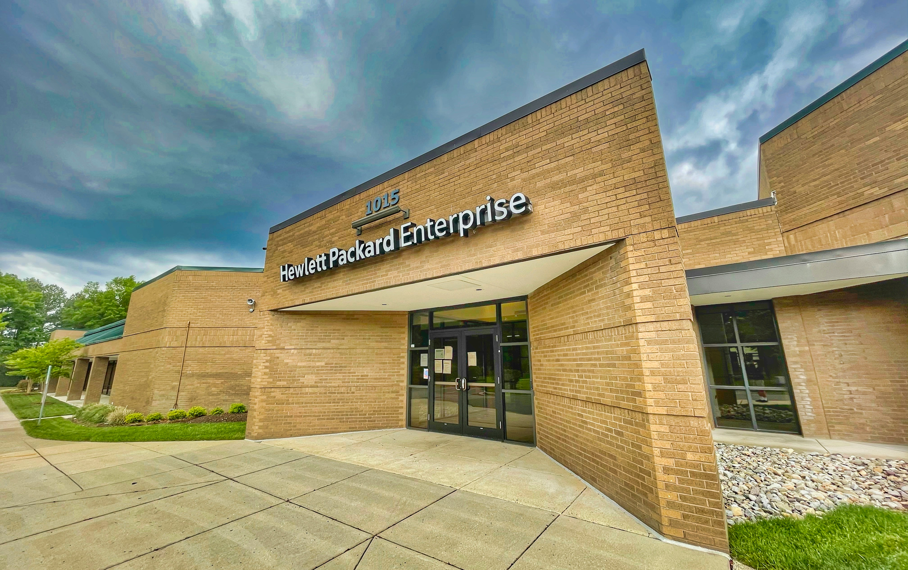
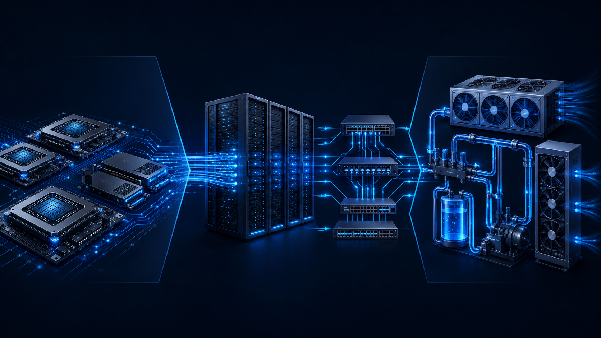

아래는 **MDX/frontmatter 없이 본문만** 더 자세히 확장한 버전입니다.

---

엔비디아만 보던 AI 투자자들이 최근에는 델과 HPE 같은 서버 회사까지 보기 시작했습니다. 예전에는 “AI 수혜주”라고 하면 GPU를 만드는 엔비디아, AI 반도체를 생산하는 파운드리, HBM 메모리 기업 정도가 먼저 떠올랐습니다. 그런데 AI 데이터센터 투자가 커지면서 흐름이 조금 달라지고 있습니다.

결론부터 말하면, AI 수혜는 이제 GPU 하나에서 끝나지 않습니다. GPU를 장착할 서버, 서버끼리 데이터를 주고받는 네트워킹 장비, 대규모 전력과 냉각 시스템, 그리고 이를 구축하는 인프라 기업까지 수혜 범위가 넓어지고 있습니다. 델과 HPE가 주목받는 이유도 여기에 있습니다. 다만 두 회사가 받는 수혜의 성격은 다릅니다. 델은 AI 서버 수요가 직접적으로 매출에 반영되는 구조이고, HPE는 서버와 네트워킹, 엔터프라이즈 인프라를 함께 묶어 파는 구조에 가깝습니다.

## 왜 갑자기 AI 서버 수혜주가 주목받을까?

AI 서버 수혜주가 주목받는 가장 큰 이유는 AI 투자의 중심이 “칩 구매”에서 “데이터센터 구축”으로 넘어가고 있기 때문입니다. 초기 AI 랠리에서는 엔비디아 GPU를 얼마나 확보하느냐가 핵심이었습니다. 하지만 기업들이 실제로 AI 서비스를 운영하려면 GPU만 사서는 부족합니다. GPU를 장착할 서버가 필요하고, 서버를 연결할 네트워크가 필요하며, 막대한 전력을 안정적으로 공급하고 열을 식히는 냉각 설비도 필요합니다.

쉽게 비유하면 GPU는 AI 데이터센터의 두뇌입니다. 하지만 두뇌만 있다고 사람이 움직이지는 않습니다. 뼈대, 혈관, 근육, 에너지 공급망이 함께 있어야 합니다. AI 서버는 바로 이 두뇌를 실제로 작동시키는 몸체에 해당합니다.

| AI 투자 단계 | 대표 영역     | 투자자가 보는 포인트        |
| -------- | --------- | ------------------ |
| 1단계      | GPU       | AI 연산 수요 증가        |
| 2단계      | 서버        | GPU를 장착하는 하드웨어 플랫폼 |
| 3단계      | 네트워킹      | 서버 간 데이터 이동 속도     |
| 4단계      | 전력·냉각     | 데이터센터 운영 비용        |
| 5단계      | 소프트웨어·서비스 | 실제 AI 활용 확산        |

이 흐름 때문에 시장은 “엔비디아 다음은 어디인가?”라는 질문을 던지고 있습니다. 그 답 중 하나가 델, HPE 같은 AI 서버·인프라 기업입니다.

## 델은 왜 급등했나? AI 서버 전망 상향이 핵심

델이 주목받은 핵심 이유는 AI 서버 전망이 크게 올라갔기 때문입니다. 델은 오래전부터 PC 기업 이미지가 강했습니다. 많은 투자자에게 델은 노트북, 데스크톱, 기업용 PC를 파는 회사로 기억됩니다. 하지만 최근 시장이 델을 다시 보기 시작한 이유는 PC가 아니라 AI 서버입니다.

델은 엔비디아 GPU를 탑재한 AI 서버를 대형 클라우드 기업, 엔터프라이즈 고객, 데이터센터 사업자에게 공급하는 구조를 갖고 있습니다. AI 모델을 학습하고 추론하려는 기업이 늘어날수록 고성능 서버 수요도 함께 증가합니다. 이 과정에서 델은 GPU를 직접 만드는 회사는 아니지만, GPU가 실제 데이터센터에 들어갈 수 있도록 서버 형태로 조립하고 공급하는 역할을 합니다.

| 델의 핵심 포인트      | 의미                |
| -------------- | ----------------- |
| AI 서버 매출 전망 상향 | 수요가 예상보다 강하다는 신호  |
| 대형 고객 중심 공급    | 한 번의 주문 규모가 큼     |
| PC보다 서버 부각     | 사업 이미지가 바뀌는 구간    |
| 엔비디아 기반 서버     | AI 인프라 투자와 직접 연결  |
| 인프라 매출 확대      | 단순 PC 기업에서 재평가 가능 |

델의 강점은 실행력입니다. AI 서버 시장에서는 단순히 제품을 만들 수 있다는 것만으로 충분하지 않습니다. 대형 고객이 원하는 사양에 맞춰 빠르게 공급하고, 부품을 확보하며, 납기와 품질을 맞춰야 합니다. 델은 기존 기업 고객 기반과 공급망 운영 경험이 있기 때문에 AI 서버 수요가 커질 때 빠르게 대응할 수 있는 기업으로 평가받고 있습니다.

## HPE는 델과 무엇이 다를까?

HPE는 델과 비슷하게 서버를 팔지만, 시장에서 보는 포인트는 조금 다릅니다. 델이 AI 서버 매출 규모와 공급 실행력이 강점이라면, HPE는 서버뿐 아니라 네트워킹, 스토리지, 엔터프라이즈 인프라를 함께 묶어 제공하는 구조가 강점입니다.

AI 데이터센터에서는 서버만 중요한 것이 아닙니다. 수천 개, 많게는 수만 개의 GPU 서버가 동시에 작동하려면 서버 간 데이터 이동 속도가 매우 중요합니다. 이때 네트워킹 장비와 인프라 설계 능력이 부각됩니다. HPE가 AI 인프라 패키지 기업으로 평가받는 이유가 여기에 있습니다.

| 구분     | 델               | HPE             |
| ------ | --------------- | --------------- |
| 핵심 이미지 | AI 서버 공급사       | AI 인프라 패키지 기업   |
| 주요 강점  | 서버 규모, 공급망 실행력  | 네트워킹, 기업 인프라    |
| 고객군    | 대형 클라우드·기업 고객   | 엔터프라이즈·데이터센터 고객 |
| 관찰 지표  | AI 서버 매출, 주문 증가 | 백로그, 네트워킹 매출    |
| 리스크    | 마진 압박, 고객 집중    | 통합 효과, 성장 지속성   |

HPE는 특히 기업 고객 기반이 중요합니다. 모든 기업이 초대형 클라우드처럼 직접 AI 데이터센터를 만들 수 있는 것은 아닙니다. 많은 기업은 자체 AI 인프라를 구축하거나 하이브리드 클라우드 환경에서 AI를 운영하려고 합니다. 이때 서버, 스토리지, 네트워킹, 관리 솔루션을 함께 제공하는 기업이 필요합니다. HPE의 수혜 구조는 바로 이 지점과 연결됩니다.

## 델 vs HPE, AI 수혜 구조는 어떻게 다를까?

델과 HPE를 비교할 때 중요한 질문은 “누가 더 좋은가?”가 아니라 “어떤 방식으로 AI 수혜를 받는가?”입니다. 델은 AI 서버 주문이 늘어나면 매출로 연결되는 구조가 비교적 직관적입니다. 반면 HPE는 서버뿐 아니라 네트워킹, 인프라 통합, 기업 고객 투자 확대가 함께 맞물려야 수혜가 커집니다.

델을 볼 때는 AI 서버 매출 성장률과 마진이 중요합니다. AI 서버 매출이 빠르게 늘어나더라도 GPU, 메모리, 네트워킹 부품 가격이 높으면 이익률이 낮아질 수 있습니다. 그래서 매출 증가만 보고 판단하기보다, 실제 이익이 얼마나 남는지를 함께 봐야 합니다.

HPE를 볼 때는 백로그와 네트워킹 성장률이 중요합니다. 백로그는 아직 매출로 인식되지 않았지만 앞으로 납품될 주문을 뜻합니다. AI 인프라 수요가 강하다면 백로그가 늘어나고, 이후 실제 매출로 전환되는지가 관찰 포인트가 됩니다.

투자자가 비교할 핵심 지표는 다음과 같습니다.

| 비교 항목    | 왜 중요한가           |
| -------- | ---------------- |
| AI 서버 매출 | 실제 수요가 숫자로 확인되는지 |
| 영업이익률    | 매출 성장의 질이 좋은지    |
| 백로그      | 미래 매출 가시성이 있는지   |
| 고객 집중도   | 특정 고객 의존 리스크가 큰지 |
| 네트워킹 매출  | AI 인프라 확산이 이어지는지 |
| 밸류에이션    | 기대가 이미 가격에 반영됐는지 |

정리하면 델은 “AI 서버 판매가 얼마나 커지는가”가 핵심이고, HPE는 “AI 인프라 전체 수요를 얼마나 묶어서 가져가는가”가 핵심입니다.

## 서버주 랠리에서 조심해야 할 3가지는?

AI 서버 수요가 강하다고 해서 서버주가 항상 좋은 흐름을 보이는 것은 아닙니다. 서버 사업은 매출 규모가 크지만, 부품 원가도 큽니다. 특히 AI 서버는 고가 GPU, 고성능 메모리, 네트워킹 부품이 들어가기 때문에 매출은 빠르게 늘어도 이익률은 기대보다 낮을 수 있습니다.

첫 번째 리스크는 마진 압박입니다. AI 서버는 단가가 높지만 핵심 부품 가격도 높습니다. 고객이 대형 기업일수록 가격 협상력도 강합니다. 따라서 매출이 증가해도 영업이익률이 따라오지 않으면 주가는 실망할 수 있습니다.

두 번째 리스크는 고객 집중도입니다. AI 서버 주문은 대형 클라우드 기업이나 특정 대기업 고객에 집중될 수 있습니다. 특정 고객의 투자 속도가 늦어지면 서버 업체의 실적 변동성도 커질 수 있습니다.

세 번째 리스크는 기대치 선반영입니다. 주가가 먼저 급등하면 좋은 실적이 나와도 시장 기대에 못 미치면 조정을 받을 수 있습니다. AI 서버 수요가 실제로 강한지와 별개로, 현재 주가가 어느 정도 기대를 반영했는지를 함께 봐야 합니다.

| 리스크    | 확인할 점                 |
| ------ | --------------------- |
| 마진 압박  | 매출 증가가 이익 증가로 이어지는가   |
| 고객 집중  | 특정 대형 고객 의존도가 높은가     |
| 기대 선반영 | 실적 발표 전 주가가 과도하게 올랐는가 |

AI 서버주는 성장 산업에 속하지만, 제조업적 성격도 강합니다. 그래서 “AI”라는 단어만 보고 판단하기보다 수주, 매출, 마진, 현금흐름을 함께 확인해야 합니다.

## 오늘의 이슈 레이더에서 확인할 포인트는?

스톡핑 앱에서는 오늘의 이슈 레이더를 시장 이슈 화면에서 확인할 수 있습니다. 델·HPE처럼 실적과 가이던스 변화로 급등한 미국주식 뉴스는 단순히 “주가가 올랐다”는 제목만 보는 것보다 어떤 키워드가 관련주로 확산되는지 함께 보는 것이 중요합니다. AI 서버, 데이터센터, 네트워킹, 전력, 냉각 같은 키워드가 동시에 움직이는지 확인하면 단기 급등인지 산업 확산인지 더 빠르게 구분할 수 있습니다.

예를 들어 델의 AI 서버 전망 상향 뉴스가 나온 뒤 HPE, 슈퍼마이크로, 네트워킹 장비주, 전력 인프라 관련주까지 함께 움직인다면 시장은 이를 단순한 개별 기업 호재가 아니라 AI 인프라 확산 신호로 해석하고 있을 가능성이 있습니다. 반대로 델만 강하고 다른 관련주가 따라오지 않는다면 개별 실적 이슈에 가까울 수 있습니다.

이런 흐름을 볼 때는 다음 순서로 확인하는 것이 좋습니다.

1. 급등 뉴스의 핵심 키워드가 무엇인가
2. 같은 키워드를 가진 관련 종목도 움직였는가
3. 거래량이 함께 증가했는가
4. 실적 전망이나 가이던스 변화가 있었는가
5. 밸류에이션 부담은 커지지 않았는가

단순히 오른 종목을 찾는 것이 아니라, 왜 올랐고 그 이유가 다른 종목으로 확산되는지를 보는 것이 핵심입니다.

## 한 줄 요약: AI 수혜는 ‘칩’에서 ‘인프라’로 넓어지는 중

엔비디아는 여전히 AI 랠리의 중심에 있습니다. GPU 수요가 강해야 AI 서버 수요도 커지기 때문입니다. 하지만 최근 시장 흐름은 AI 수혜가 GPU에서 끝나지 않고 서버, 네트워킹, 전력, 냉각, 데이터센터 장비로 확산되고 있음을 보여줍니다.

델은 AI 서버 수요가 직접적으로 매출에 연결되는 기업으로 볼 수 있습니다. HPE는 서버뿐 아니라 네트워킹과 엔터프라이즈 인프라를 함께 제공하는 기업으로 볼 수 있습니다. 두 회사 모두 AI 인프라 확산을 이해하는 데 중요한 관찰 대상이지만, 수혜 구조는 다릅니다.

결국 투자자가 봐야 할 것은 “AI라는 단어가 붙었는가”가 아닙니다. 실제 매출이 늘고 있는지, 마진이 유지되는지, 백로그가 매출로 전환되는지, 고객 기반이 안정적인지, 주가가 기대를 과하게 반영했는지를 함께 확인해야 합니다. AI 랠리의 다음 장면은 반도체 칩 하나가 아니라, 그 칩을 실제로 돌리는 인프라 전체에서 펼쳐지고 있습니다.
