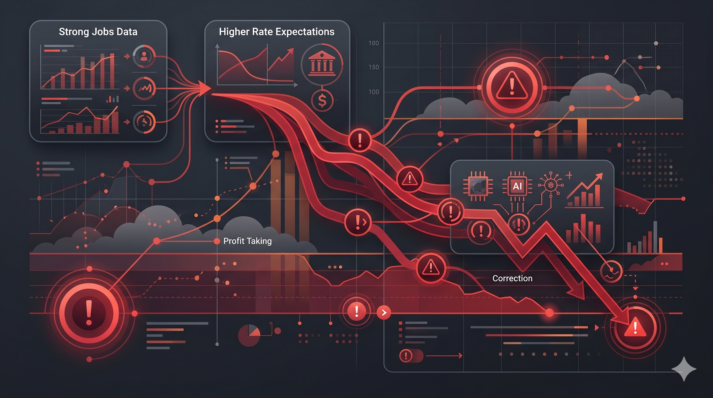
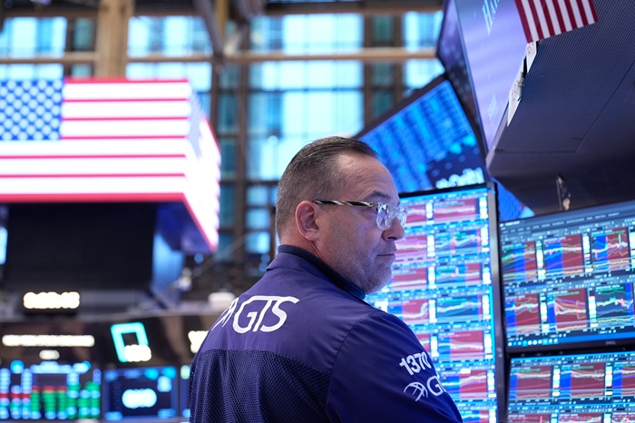

QQQ, TQQQ, SOXL을 들고 있던 투자자에게 6월 5일 미국 시장은 하루 만에 분위기가 완전히 바뀐 날이었습니다. 결론부터 말하면, 이번 하락은 경기 침체 공포라기보다 “강한 고용지표 → 금리 부담 → 과열된 AI·반도체 차익실현”이 겹친 조정 성격이 강합니다. 다만 CPI와 FOMC를 앞두고 있어 다음주까지 변동성은 열어둬야 합니다.

## 어제 미국 시장은 얼마나 크게 빠졌나?

어제 미국 시장은 기술주와 반도체 중심으로 크게 흔들렸습니다. Nasdaq은 4% 넘게 빠지며 1년여 만의 최악의 날을 기록했고, S\&P 500도 2%대 하락했습니다. 특히 충격이 컸던 곳은 반도체였습니다. PHLX 반도체지수(SOX)는 10% 넘게 급락했고, 미국 상장 칩주 시가총액 약 1.3조 달러가 하루 만에 사라졌습니다.

| 구분       | 시장 반응        |
| -------- | ------------ |
| S\&P 500 | 약 2.6% 하락    |
| Nasdaq   | 약 4.2% 하락    |
| SOX 지수   | 약 10.3% 급락   |
| 칩주 시총    | 약 1.3조 달러 감소 |

중요한 점은 시장 전체가 무너졌다기보다, 그동안 많이 올랐던 AI·반도체 쪽에 매도가 집중됐다는 점입니다.

## 왜 좋은 고용지표가 악재가 됐을까?

이번 하락을 이해하려면 “Good news is bad news”를 알아야 합니다. 원래 고용이 좋다는 것은 경제가 튼튼하다는 뜻입니다. 하지만 지금 시장은 다르게 해석했습니다. 고용이 강하면 임금과 소비가 버티고, 물가 압력이 쉽게 내려가지 않을 수 있습니다. 그러면 금리가 더 오래 높게 유지되거나, 경우에 따라 다시 인상될 수 있다는 걱정이 커집니다.

흐름은 이렇게 이어집니다.

1. 고용지표가 예상보다 강하게 나옵니다.
2. 시장은 금리 부담이 커질 수 있다고 봅니다.
3. 미래 성장 기대가 큰 기술주가 먼저 압박을 받습니다.
4. 이미 많이 오른 AI·반도체에서 차익실현이 나옵니다.

즉, 좋은 고용지표 자체가 나쁜 것이 아니라, 지금 시장이 “금리”에 민감한 상태였기 때문에 악재처럼 작동한 것입니다.

## 진짜 핵심은 AI·반도체 기대치 조정일까?

이번 하락의 핵심은 AI 성장성이 사라졌다는 뜻이 아닙니다. 오히려 AI 수요는 여전히 강합니다. 문제는 주가가 이미 너무 높은 기대를 반영하고 있었다는 점입니다. 브로드컴 실적 발표 이후 시장은 AI 칩 전망이 기대만큼 더 높아지지 않았다는 데 실망했고, 그 분위기가 반도체 섹터 전체로 번졌습니다.

AI 반도체주는 이제 단순히 “성장한다”는 말만으로는 부족합니다. 시장은 “예상보다 더 성장하느냐”, “가이던스가 상향됐느냐”, “밸류에이션이 정당화되느냐”를 봅니다. 그래서 이번 매도는 AI 산업이 꺾였다는 신호라기보다, 높아진 기대치를 다시 조정하는 과정으로 보는 것이 더 적절합니다.

| 기대치 조정 포인트 | 확인할 내용               |
| ---------- | -------------------- |
| 가이던스       | 시장 예상보다 높았는가         |
| 밸류에이션      | 이미 많이 비싸졌는가          |
| 차익실현       | 연초 이후 급등폭이 컸는가       |
| 섹터 확산      | 개별주가 아닌 반도체 전체가 빠졌는가 |

!\[미국 증시 급락과 AI 반도체 기대치 조정]\(/images/blog/us-market-healthy-correction-ai-stocks-01.png)

## 건강한 조정인지 보는 3가지 기준은?

미국 시장 건강한 조정인지 보려면 단순히 하락률만 보면 안 됩니다. 첫째, 하락의 원인이 경기 침체인지 금리 재평가인지 봐야 합니다. 경기 침체라면 소비·고용·기업 실적이 동시에 무너지는 흐름이 나옵니다. 반면 이번처럼 고용이 강해서 금리 부담이 커진 경우는 성격이 다릅니다.

둘째, 매도세가 시장 전체로 번졌는지, 특정 과열 섹터에 집중됐는지 봐야 합니다. 이번 하락은 AI·반도체 중심의 매도가 두드러졌습니다. 셋째, 실적 전망이 무너졌는지 확인해야 합니다. 기업의 매출과 이익 전망이 크게 꺾이지 않고, 밸류에이션만 낮아지는 조정이라면 장기 상승 흐름 안의 흔들림일 수 있습니다.

| 기준 | 건강한 조정       | 위험한 하락      |
| -- | ------------ | ----------- |
| 원인 | 금리·밸류에이션 재평가 | 경기 침체·실적 훼손 |
| 범위 | 과열 섹터 중심     | 전 섹터 동반 붕괴  |
| 실적 | 전망 유지        | 가이던스 하향 확산  |
| 심리 | 차익실현         | 신용·유동성 불안   |

이번 하락은 아직까지는 “위험한 붕괴”보다 “기대치와 밸류에이션 조정”에 더 가깝습니다. 다만 다음주 CPI가 높게 나오면 금리 부담이 더 커질 수 있어 확인이 필요합니다.

## 레버리지 ETF 투자자가 조심해야 할 점은?

TQQQ, SOXL 같은 레버리지 ETF를 보유한 투자자는 이번 조정을 더 크게 느꼈을 가능성이 높습니다. 레버리지 ETF는 상승장에서는 수익률을 키우지만, 급락장에서는 손실도 빠르게 커집니다. 특히 변동성이 큰 구간에서는 지수가 제자리로 돌아와도 레버리지 ETF의 회복 속도가 더 느려질 수 있습니다.

가장 위험한 행동은 급락 직후 감정적으로 비중을 크게 늘리는 것입니다. 반대로 공포에 전량 정리하는 것도 계획이 없다면 흔들릴 수 있습니다. 중요한 것은 본인이 감당할 수 있는 비중과 손실폭을 미리 정하는 것입니다.

* 하루 변동폭이 일반 ETF보다 훨씬 큽니다.
* 급락과 반등이 반복되면 복리 손실이 커질 수 있습니다.
* 추격매수보다 분할 접근과 비중 관리가 중요합니다.
* SOXL은 반도체 집중도가 높아 QQQ보다 변동성이 클 수 있습니다.

레버리지 ETF는 방향을 맞히는 상품이 아니라 변동성을 견딜 수 있는 규칙이 필요한 상품입니다.

## 다음주 시장에서 봐야 할 변수는?

다음주 핵심은 예측보다 확인입니다. 가장 먼저 볼 것은 6월 10일 발표되는 5월 CPI입니다. CPI가 예상보다 높으면 금리 부담이 다시 커질 수 있고, 예상보다 안정적이면 급락장의 공포가 일부 완화될 수 있습니다. 이후 6월 16\~17일 FOMC에서는 금리 결정뿐 아니라 점도표와 기자회견의 톤이 중요합니다.

그다음은 10년물 국채금리, VIX, SOX 지수 반등 여부입니다. 특히 반도체 지수가 빠르게 회복되는지, 아니면 추가 매도가 이어지는지가 AI 주식 기대치 조정의 깊이를 보여줄 수 있습니다.

| 체크포인트   | 봐야 할 이유       |
| ------- | ------------- |
| 5월 CPI  | 금리 부담의 방향 결정  |
| FOMC    | 연준의 정책 톤 확인   |
| 10년물 금리 | 성장주 밸류에이션 압박  |
| VIX     | 공포 심리 확산 여부   |
| SOX 지수  | AI 반도체 반등 확인  |
| QQQ     | 기술주 전반 회복력 점검 |

다음주는 “반등할까, 더 빠질까”를 맞히는 주간이 아니라, 시장이 이번 하락을 어느 정도까지 소화하는지 확인하는 구간입니다.

## 스톡핑 오늘의 이슈 레이더로 무엇을 확인할까?

스톡핑 앱에서는 오늘의 이슈 레이더를 통해 미국 시장 급락의 원인과 관련 종목, ETF 움직임을 한 화면에서 확인할 수 있습니다. 단순히 “폭락”이라는 제목만 보는 것이 아니라, 고용지표·금리·AI 반도체 매도세가 어떤 순서로 연결됐는지 함께 보면 시장 반응을 더 차분하게 해석할 수 있습니다.

급락장에서는 뉴스 제목보다 연결고리가 중요합니다. 고용지표가 금리를 움직였는지, 금리가 QQQ를 눌렀는지, 반도체 매도가 SOXL까지 번졌는지 확인하면 대응 기준이 더 명확해집니다.

## 한 줄 요약: 이번 하락은 공포보다 기대치 조정에 가깝다

이번 미국 증시 폭락은 경제가 갑자기 무너졌기 때문이라기보다, 강한 고용지표와 AI·반도체 과열 부담이 동시에 터진 조정에 가깝습니다. 특히 반도체주는 그동안 기대가 컸던 만큼 작은 실망에도 크게 흔들렸습니다.

다만 건강한 조정인지 위험한 하락인지는 다음주 지표가 결정합니다. CPI가 안정되고 금리가 진정되며 SOX 지수가 반등한다면 이번 하락은 과열 해소로 해석될 수 있습니다. 반대로 CPI가 높고 금리가 더 오르며 반도체 매도가 이어진다면 변동성은 더 커질 수 있습니다. 지금은 예측보다 확인이 중요한 구간입니다.
