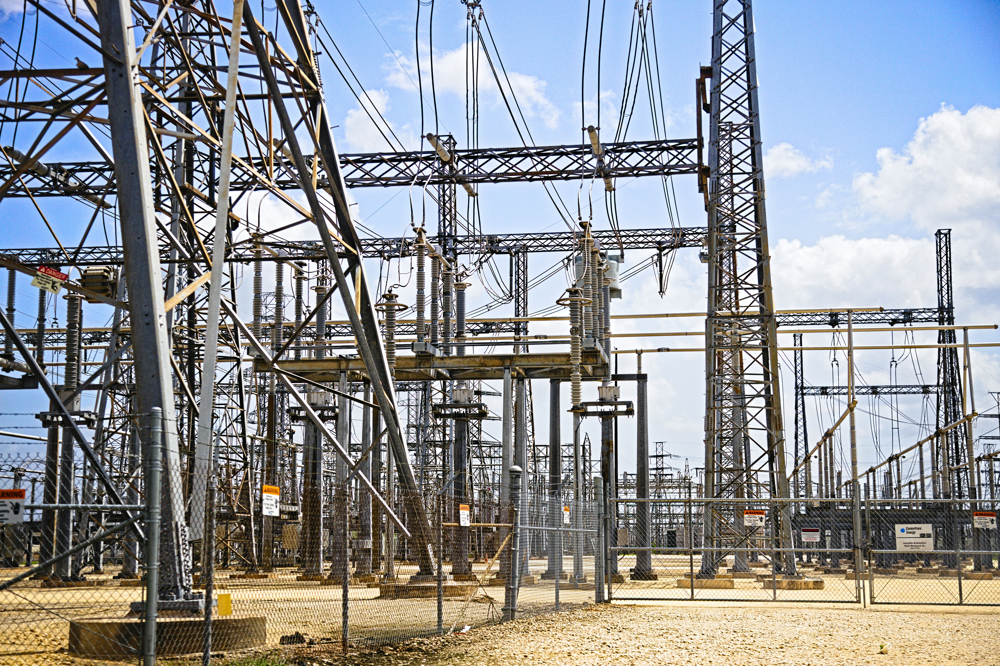
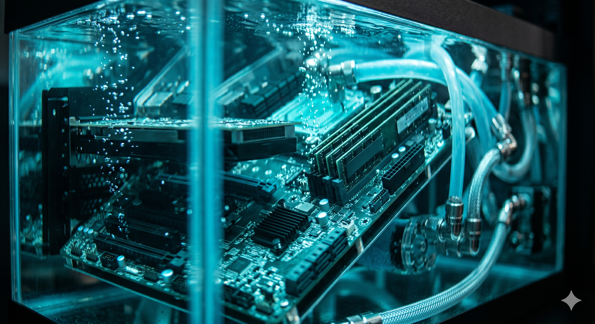
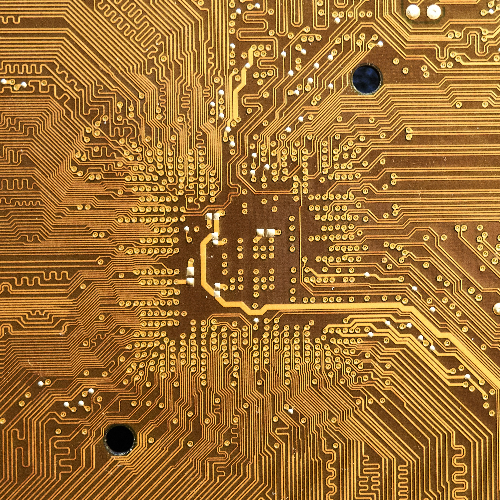
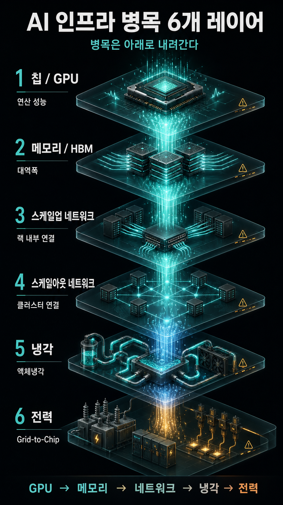

# GPU 다음은 '칩'이 아니라 '스택'이다 — AI 인프라 병목이 아래로 내려가는 6개 레이어 완전 해부

> *2026년 5월 기준. 산업 흐름과 시장에서 거론되는 사례를 정리한 글이며, 투자 자문이나 특정 종목 추천이 아닙니다. 글 말미의 유의사항을 반드시 확인하세요.*

---

## 들어가며: 질문이 바뀌었다

지난 2년간 시장의 질문은 단순했다. "엔비디아 다음 GPU는 얼마나 빠른가." 하지만 2026년 들어 질문의 형태 자체가 달라졌다. 지금 진짜 돈이 묻는 질문은 이것이다.

**"GPU가 만들어낸 병목은 다음으로 어디로 옮겨갔는가."**

이 차이는 단순한 표현 차이가 아니다. 전자는 한 종목의 성능 경쟁을 보는 시선이고, 후자는 한 칩이 만들어내는 부담이 산업 전체로 연쇄 확산되는 구조를 보는 시선이다. 이 글은 후자의 관점에서, AI 인프라가 어떻게 '6개 레이어 전체를 동시에 업그레이드하는' 거대한 동조화 사이클로 진입했는지를 데이터로 풀어낸다.

---

## 1. 핵심 프레임: "병목은 아래로 내려간다"

AI 인프라를 이해하는 가장 정확한 한 문장은 이것이다.

> 초기 병목은 GPU였다. GPU 수급이 풀리면 메모리 대역폭이 발목을 잡고, 네트워크가 해결되면 냉각이 한계를 드러내며, 그 모든 것을 돌리려는 순간 전력이 어디서나 바닥을 보인다.

즉 투자 자금은 '칩 한 종목'이 아니라 **칩 · 메모리 · 스케일업 네트워크 · 스케일아웃 네트워크 · 냉각 · 전력**이라는 6개 레이어로 동시에 흘러 들어가고 있다. 한 레이어의 성능을 높이면 그 부담이 곧바로 아래 레이어의 수요로 전이되기 때문이다.

이것이 '단순 종목 급등'과 '산업 확산'을 가르는 결정적 지점이다. GPU 한 종목이 오른 게 아니라, **GPU가 만든 열·전력·연결 부담이 연쇄적으로 다음 산업의 매출을 창출하는 구조**라는 뜻이다. 그래서 이 사이클은 한 종목의 밸류에이션 논쟁으로 끝나지 않고, 변압기·가스터빈·냉각수 펌프·기판·테스트 소켓이라는 전혀 다른 업종으로 번져 나간다.

---

## 2. 병목을 만드는 엔진: GPU 로드맵이 '랙 전력'을 폭발시킨다

확산의 출발점을 정확히 이해하려면 엔비디아의 로드맵부터 봐야 한다. 핵심은 칩 성능이 아니라 **랙(rack)당 전력 밀도의 기하급수적 증가**다.

엔비디아는 연 단위 케이던스를 사실상 확정했다. Blackwell(2024) → Blackwell Ultra(2025) → Rubin(2026) → Rubin Ultra(2027) → Feynman(2028)으로 이어지는 라인이다. 그리고 세대가 올라갈 때마다 랙 전력은 이렇게 움직인다.

| 시점            | 대표 플랫폼                     | 랙당 전력(개략) |
| ------------- | -------------------------- | --------- |
| \~2023년 일반 서버 | 전통 랙                       | 8\~10kW   |
| 2026년         | Vera Rubin NVL72           | 250kW 이상  |
| 2027년         | Rubin Ultra NVL576 'Kyber' | 약 600kW   |
| 2028년(전망)     | Feynman                    | 약 1MW     |

불과 몇 년 사이에 랙 하나가 소비하는 전력이 **수십 배에서 100배 규모로** 뛰는 것이다. 2026년 하반기 출하되는 Vera Rubin NVL72만 해도 72개의 Rubin GPU와 36개의 Vera CPU를 한 랙에 담아 250kW를 넘기며, 전력 분배 방식을 기존 48V에서 **800V DC 아키텍처**로 바꾸고 \*\*100% 액체냉각(입수 온도 45℃)\*\*을 전제로 설계됐다. 공랭으로는 더 이상 감당이 안 되는 영역에 진입했다는 뜻이다.

여기서 두 갈래의 부담이 동시에 터진다.

* **"이 전기를 어디서 끌어오나"** → 전력 인프라 레이어
* **"이 열을 어떻게 빼나"** → 냉각 레이어

이 둘이 지금(2026년 5월) 시장이 가장 뜨겁게 보는 두 축이다. 차례로 보자.

---

## 3. 가장 뜨거운 다음 테마: 전력 인프라

### 3-1. 'Grid-to-Chip', 설계의 무게중심이 옮겨갔다

랙 전력이 100kW를 넘어 수백 kW로 치솟으면서, 데이터센터 설계의 패러다임이 개별 시스템 단위에서 **전력망부터 연산 칩까지 전 과정을 통합 관리하는 'Grid-to-Chip' 개념**으로 전환되고 있다. 칩만 잘 만들어선 의미가 없고, 발전소에서 칩까지 이어지는 전력 사슬 전체가 병목 없이 흘러야 한다는 사고방식이다.

그 사슬의 가장 약한 고리가 바로 **초고압 변압기**다.

### 3-2. 변압기 — '없어서 못 파는' 구조적 공급 부족

이건 테마가 아니라 물리적 수급 문제다. 미국 에너지부(DOE) 보고서에 따르면 현지에서 변압기를 주문한 뒤 인도받기까지 걸리는 시간은 길게는 4년에 달한다. 노후 전력망 교체 수요와 신규 AI 데이터센터 수요가 동시에 폭발했는데, 미국 내 생산능력만으로는 도저히 감당이 안 되는 상황이다. 일부 현장에선 중고 변압기를 개조해 쓰는 사례까지 거론될 정도다.

수요 측 압력을 보여주는 숫자도 선명하다. 미국 최대 전력망 운영사 PJM의 2027\~2028년도 용량 경매에서 낙찰가가 MW-day당 333.44달러를 기록하며 1년 만에 약 10배 수준으로 폭등했다. '에너지 인플레이션'이라는 표현이 과장이 아닌 국면이다. 여기에 장거리 대용량 송전을 위해 **765kV급 초대형 변압기**가 데이터센터 유치 경쟁력의 핵심으로 부상하고 있다.

이 공급 부족이 그대로 한국 전력기기 3사의 수주 잔고로 직결되고 있다.

* **HD현대일렉트릭**: 2025년 3분기 말 수주잔고 약 9.7조 원(69.8억 달러)으로 분기 최고치를 경신. 영업이익률 24.8%로 3사 중 최고 수준이며, 고부가 초고압 변압기·리액터 비중 확대가 수익성을 끌어올렸다.
* **LS ELECTRIC**: 2026년 1분기 말 별도 기준 수주잔고 5.6조 원, 자회사 포함 연결 7.2조 원. 이 중 초고압 변압기 수주잔고만 3.1조 원이다. 미국 하이퍼스케일 데이터센터향 배전반(미국 빅테크에 1,700억 원대 공급) 등으로 영역을 넓히고 있다.
* **효성중공업**: 북미 중심으로 3사 모두 역대 최고 수준의 잔고를 경신 중.

여기서 한 가지 분석적 포인트. 변압기·배전반은 **납기와 매출 전환 속도가 다르다.** 초고압 변압기는 설계-제작-설치까지 길고 복잡한 반면, 배전반은 상대적으로 대량 생산이 가능하고 납기가 짧다. 즉 같은 '전력기기'라도 잔고가 실제 실적으로 바뀌는 타이밍이 품목별로 다르다는 점을 구분해서 봐야 한다. 잔고의 '크기'만이 아니라 '전환 속도'가 다음 국면의 변수다.

### 3-3. 전기를 '어디서 구하나' — 원전·SMR·가스터빈

변압기로 송배전이 풀려도 근본 질문이 남는다. **애초에 이 막대한 전기를 어디서 발전하나.** AI 데이터센터는 24시간 끊김 없는 안정 전력을 요구하기 때문에, 간헐성이 있는 재생에너지만으로는 부족하고 \*\*무탄소·기저부하 전원인 원전·SMR(소형모듈원전)\*\*과, 빠르게 지을 수 있는 **가스터빈**까지 수혜 범위가 넓어졌다.

두산에너빌리티가 이 흐름의 한국 대표 사례로 거론된다. 2025년 신규 수주 14.7조 원으로 역대 최대(전년 대비 약 106% 증가)를 기록했고, SMR 분야에선 미국 X-energy와 16기 규모의 주기기 계약을 체결했다. 가스터빈에서도 2026년 3월 미국 빅테크와 380MW급 7기(약 1.2조 원) 공급 계약을 맺으며 미국 누적 12기로 확대됐다. 생산 인프라 측면에선 2026년 3월부터 2031년 6월까지 약 8,068억 원을 투입해 창원에 **연 20기 규모의 SMR 전용 공장**을 구축한다.

다만 여기서 **냉정한 구분**이 필요하다. 가스터빈과 대형 원전 주기기는 이미 계약·매출로 확인되는 영역인 반면, **SMR은 아직 상용화 초기 단계**다. 정책 로드맵과 안전 규제에 따라 일정이 흔들릴 수 있고, 'SMR 기대감'의 상당 부분은 확정 실적이 아니라 테마성 기대가 섞여 있다. 같은 종목 안에서도 '확정된 캐시플로'와 '먼 미래의 옵션 가치'를 분리해서 봐야 과열에 휩쓸리지 않는다.

---

## 4. 전력과 한 몸인 테마: 냉각의 패러다임 전환

랙당 수백 kW의 열은 공기로 식힐 수 없다. 그래서 냉각은 '있으면 좋은 옵션'에서 '없으면 가동 불가능한 필수'로 위상이 바뀌었다.

시장 데이터가 이 전환을 뒷받침한다. 데이터센터 액체냉각 시장은 2026년 약 66억 달러에서 2033년 384억 달러로, 연평균 28%대 성장이 전망된다. 현재 주력은 칩에 직접 냉각판을 붙이는 \*\*다이렉트-투-칩(DLC, 매출의 40% 중반대)\*\*이며, 랙 밀도가 100kW를 넘어가는 초고밀도 구간에서는 액체에 서버를 통째로 담그는 \*\*침지냉각(immersion)\*\*이 사실상 유일한 대안으로 거론된다.

수요자 측 움직임도 구체적이다. 마이크로소프트는 자사 데이터센터의 액체냉각 침투율을 2025년 15%에서 2028년 40%까지 끌어올리겠다는 목표를 제시했다. 앞서 본 대로 엔비디아 Vera Rubin NVL72는 아예 100% 액체냉각을 전제로 설계됐다.

산업 구조 측면에서 주목할 변화는 두 가지다.

1. **엔드투엔드 통합 솔루션화** — 서버·전력·냉각을 따로 파는 게 아니라 하나로 묶어 공급하는 방향으로 시장이 재편되고 있다. 냉각이 더 이상 부속이 아니라 시스템 설계의 핵심 변수가 됐다는 뜻이다.
2. **냉각 분배 장치(CDU)의 부상** — 국내에선 LG전자가 냉각 용량을 2배 이상 늘린 CDU 신제품을 공개하는 등 경쟁이 본격화되고 있다.

전력과 냉각은 따로 보면 안 된다. **전력 밀도가 올라간 만큼 정확히 그만큼의 냉각 수요가 발생하는** 쌍둥이 테마이기 때문이다.

---

## 5. 옆으로도 번진다: 기판 · 패키징 · 테스트

병목은 아래(전력·냉각)로만 내려가는 게 아니라, 칩을 만드는 공정의 '옆'으로도 번진다. 과거 핵심이 GPU와 HBM이었다면, 이제 그 둘을 연결하고 검증하는 후공정·소부장(소재·부품·장비)으로 부담이 전이되고 있다.

### 5-1. 고성능 기판(FC-BGA)과 유리기판

빅테크들이 엔비디아 의존도를 줄이려 **자체 ASIC 개발**을 확대하면서, AI 서버·ASIC·CPU·네트워크용 **FC-BGA** 같은 초고성능 기판 수요가 구조적으로 늘고 있다. 서버용 FC-BGA는 일반 PC용보다 면적이 4배 이상 크고 층수가 20층 이상으로, 전 세계에서 양산 가능한 업체가 손에 꼽힌다.

삼성전기가 이 흐름의 한국 대표다. 엔비디아 NV스위치용 FC-BGA 공급을 확정한 데 이어, Vera Rubin의 추론 성능을 끌어올리는 그록(Groq)3 LPU용 FC-BGA의 '퍼스트 벤더' 지위를 확보하며 2분기부터 양산에 들어가는 것으로 관측된다. AMD·구글·아마존 등으로 고객을 다변화했고, 2026년까지 서버·AI·전장 등 고부가 FC-BGA 비중을 50% 이상으로 끌어올린다는 목표다. 플라스틱 기반 기판이 미세화 한계에 부딪히면서, 차세대 **유리기판**도 파일럿 라인 가동에 들어간 상태다. 삼성 그룹 차원에서 파운드리(칩)–메모리(HBM)–전기(기판)를 묶는 '턴키' 제안이 가능하다는 점이 경쟁력으로 거론된다.

### 5-2. 첨단 패키징과 테스트 — 성능 경쟁이 곧 소부장 수요

성능 경쟁이 치열해질수록 테스트·첨단 패키징·전공정의 난이도가 폭발적으로 증가하고, 그 부담은 그대로 후공정 장비·부품 기업의 매출로 넘어간다.

* **한미반도체**: HBM 적층의 핵심 장비인 **TC본더 시장 글로벌 1위(점유율 약 71%)**. 2026년 HBM4 양산 본격화로 2분기에 TC본더 수주가 집중되고 있으며, 회사는 2026년 HBM 매출이 전년 대비 3배 이상 늘 것으로 전망했다. 삼성전자향 TC본더(TC-NCF 방식) 공급 논의가 진행 중이고(증권가 추정 공급 규모 2,750억\~4,400억 원), 인천 주안에 약 1,000억 원을 투자한 하이브리드 본더 전용 공장과 미국 산호세 법인(한미USA) 설립으로 차세대·현지 대응을 준비하고 있다. 다만 ASMPT 등 경쟁사의 추격과 한화세미텍과의 특허 분쟁은 변수다.
* **테스트 소켓(리노공업·ISC 등)**: 칩 성능이 올라갈수록 검증 난도가 높아져 소켓 수요가 늘어난다. ISC는 유리기판·CoWoS 등 차세대 어드밴스드 패키징에 대응하는 테스트 소켓(WiDER-G)을 SKC 계열 앱솔릭스와 공동 개발하는 등 선제 대응 중이다.

요컨대 "더 빠른 칩을 향한 경쟁" 그 자체가 후공정 소부장의 구조적 수요를 만들어낸다. 칩이 빨라질수록 그것을 붙이고(패키징) 검증하는(테스트) 일이 더 어려워지기 때문이다.

---

## 6. 한국 투자자를 위한 '확산 경로 지도'

아래는 **추천 목록이 아니라**, 각 레이어에서 시장이 자주 거론하는 대표 기업을 '병목이 어디로 번지는지' 보여주는 지도로 정리한 것이다.

| 레이어             | 핵심 병목                 | 거론되는 대표 기업                   | 확인 포인트                   |
| --------------- | --------------------- | ---------------------------- | ------------------------ |
| 송배전(변압기·배전반)    | 초고압 변압기 납기 최대 4년      | LS ELECTRIC, HD현대일렉트릭, 효성중공업 | 수주 공시, 잔고의 매출 전환 속도      |
| 발전(원전·SMR·가스터빈) | 24시간 무탄소 기저전력         | 두산에너빌리티                      | 가스터빈(확정) vs SMR(기대) 구분   |
| 냉각              | 100kW+ 랙 발열           | CDU·액침냉각(예: LG전자 CDU)        | 통합 솔루션화·CDU 경쟁           |
| 기판              | ASIC·서버용 FC-BGA, 유리기판 | 삼성전기                         | 빅테크 ASIC향 수주, 유리기판 양산 시점 |
| 패키징/테스트         | HBM4 적층, 검증 난도        | 한미반도체(TC본더), 리노공업·ISC(소켓)    | 점유율·신규 고객사·특허 변수         |

---

## 7. 오늘 무엇을 볼 것인가 (Today)

뉴스 헤드라인에서 "GPU 신제품"이 보이면, 거기서 멈추지 말고 한 단계 더 들어가 보자. **그 GPU가 만들어낼 발열(kW)과 전력 수요가 어느 레이어로 번질지**를 짚어보는 것이다. 같은 날 전력기기·원전·냉각 관련주의 흐름을 함께 확인하면, 그것이 단순 급등인지 아니면 "GPU 수요가 스택 아래로 확산되는 신호"인지를 구분하는 눈이 생긴다.

특히 지금 국면에서 **선행성이 가장 높은 체크포인트** 두 가지는 이것이다.

1. **초고압 변압기·대형 전력기기 수주 공시** — 잔고가 쌓이는 속도와 품목 구성
2. **데이터센터 전력 계약·가스터빈/SMR 수주 뉴스** — 발전원 확보 경쟁의 실제 계약 여부

이 둘은 "AI 자본 지출이 진짜로 땅을 파고 들어가는 단계"를 보여주는 가장 이른 신호다.

---

## 8. 마지막으로: 과열과 구조를 구분하는 법

이 사이클의 가장 큰 함정은 '구조적 수요'와 '테마성 기대'를 뭉뚱그리는 것이다. 같은 'AI 인프라'라는 우산 아래에도 결이 전혀 다른 것들이 섞여 있다.

* **이미 계약·잔고·매출로 확인되는 것**: 전력기기 3사의 역대급 수주잔고, 두산의 가스터빈 계약, 한미의 TC본더 점유율 — 숫자가 존재한다.
* **방향성은 확고하나 시점이 불투명한 것**: SMR 상용화, 유리기판 양산, 하이브리드 본딩 전환 — 기대가 실적보다 앞서 있다.

좋은 분석은 둘을 분리한 뒤, 각각에 다른 잣대(전자는 잔고 전환 속도, 후자는 마일스톤 달성 여부)를 들이대는 것이다. "병목은 아래로 내려간다"는 프레임이 강력한 이유는, 이것이 한 종목의 스토리가 아니라 **물리 법칙(전력·열)이 강제하는 연쇄**이기 때문이다. 칩이 빨라지는 한, 그 부담은 반드시 아래 어딘가의 수요로 모습을 바꿔 나타난다.

다만 그 수요가 '어느 기업의, 언제, 얼마짜리 실적'이 될지는 전혀 다른 문제다. 그 마지막 한 칸을 메우는 것은 결국 각자의 검증 몫이다.

---

### ⚠️ 유의사항

위 내용은 산업 흐름과 시장에서 거론되는 사례를 정리한 것으로, **투자 자문이나 특정 종목 추천이 아닙니다.** 저는 금융 전문가가 아니며, 글에 언급된 수치(수주잔고·시장 전망·점유율 등)는 작성 시점(2026년 5월) 기준의 보도·발표 자료에 근거한 것으로 이후 변동될 수 있습니다. 특히 SMR·원전 정책, 유리기판·하이브리드 본딩 등 차세대 기술 관련 기대감은 확정된 실적이 아니라 기대·테마성 정보가 섞여 있으니, **반드시 최신 공시와 1차 자료를 직접 확인한 뒤 본인 판단으로 결정하시기 바랍니다.** 모든 투자의 책임은 투자자 본인에게 있습니다.
