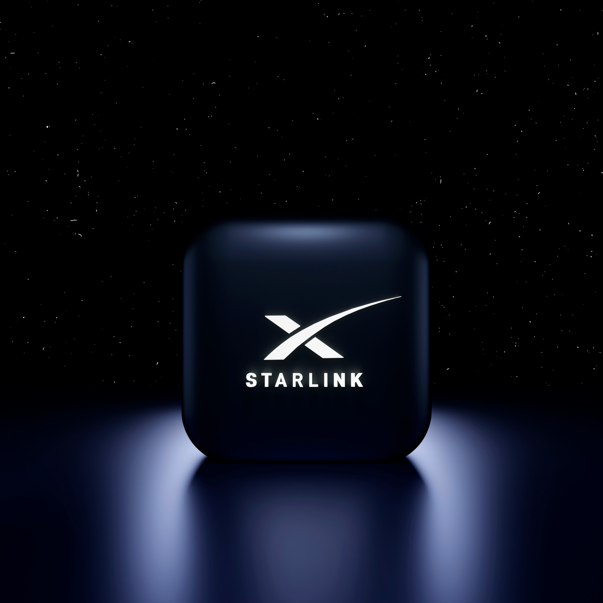
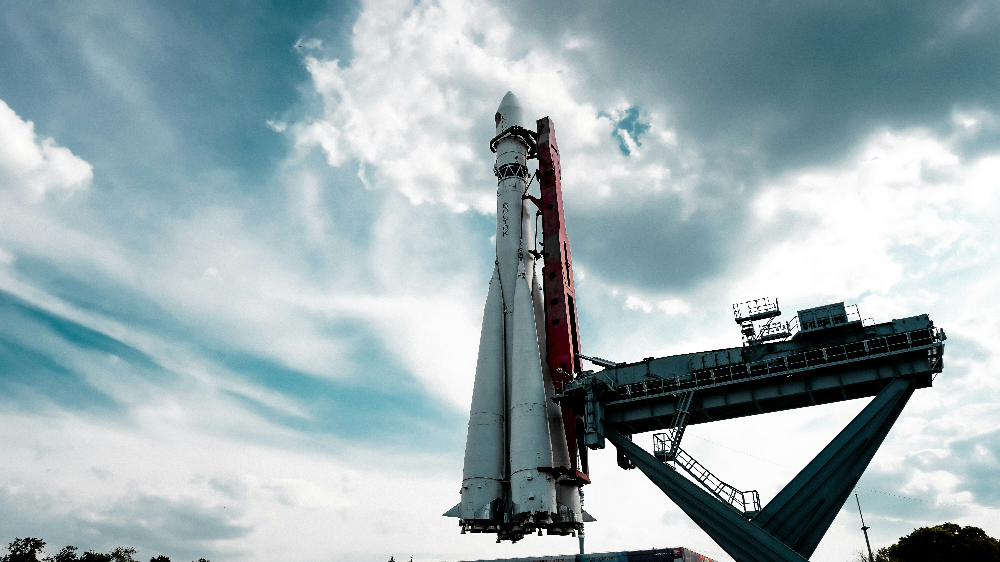

# SpaceX IPO, 왜 미국주식 시장 전체의 이슈가 됐나

> 6월 12일, 사상 최대 상장이 미국 시장을 흔든다. 우주 IPO가 아니라 'AI 인프라 메가캡' 신규 상장 이벤트로 봐야 하는 이유.

---

## 1. 헤드라인 정리: 6월 12일, 사상 최대 상장이 온다

SpaceX는 주당 **$135 고정가**, **1.75조 달러** 기업가치로 IPO를 진행하며, **6월 12일 나스닥 상장**을 목표로 한다. 총 **5억 5,560만 주**를 발행해 **약 750억 달러**를 조달하고, 인수단의 추가 옵션(8,333만 주, 약 112억 달러)까지 합치면 사실상 사상 최대 규모의 공모가 된다. 티커는 **SPCX**, 알리바바 IPO의 3배가 넘는 규모다.

비교 기준이 좀 필요하다. 기존 최대 기록은 2019년 사우디 아람코의 290억 달러였다. 750억 달러 조달이면 그걸 2.5배 깬다. 그리고 1.75조 달러라는 시총은 미국 상장사 톱10 한 자리를 즉시 차지하며, 테슬라(약 1.6조 달러)보다 위로 진입한다는 뜻이다. 상장 첫날부터 메가캡으로 들어와 버리는 상장이다.

**핵심 일정**

* S-1 제출: **2026년 5월 20일**
* S-1/A(수정) 제출: **2026년 6월 1일** (등록번호 333-296070)
* 로드쇼 시작: **2026년 6월 4일**
* 프라이싱: **2026년 6월 11일**
* 상장: **2026년 6월 12일** (나스닥 + 나스닥 텍사스 듀얼 리스팅)
* 락업 해제 윈도우: **2026년 12월** 전후 — 머스크 지분 매도 여부가 가격의 최대 변수

> **나스닥-100 패스트엔트리 규칙**: 신규 상장사가 시총 기준 현 구성 종목 상위 40위 안에 들면 **15거래일 후**에 나스닥-100에 편입될 수 있다. 즉 IPO 직후 패시브 자금이 강제 매수에 들어올 가능성이 있다 — 펀더멘털 확신과 무관한 수급 이벤트가 한 번 더 깔린다.

---

## 2. 왜 단순한 우주 IPO가 아니라 "시장 전체 이슈"인가

이번 상장이 화제가 된 데는 세 가지 구조적 이유가 겹쳐 있다.

**① 사상 최대 유동성 흡수** 약 750억 달러가 시장에서 한 번에 빠져나간다. 동시기 다른 종목 — 특히 빅테크와 AI 관련주에서 자금이 일시적으로 이탈할 수 있다는 우려가 이미 미국 시장에 깔려 있다.

**② "우주주"가 아니라 "AI 인프라주"** 이 부분이 한국 투자자가 가장 놓치기 쉬운 포인트다. SpaceX는 2026년 초 xAI를 합병해 **1.25조 달러 합산 기업가치**로 묶었고, 머스크는 이를 **SpaceXAI**라는 단일 법인으로 통합하겠다고 발표했다. S-1 상에서도 우주 + 위성 + AI 데이터센터를 하나의 회사로 평가받는 구조다.

**2026년 5월 6일**, Anthropic은 SpaceX 산하 **콜로서스 1(Colossus 1) 데이터센터**(테네시주 멤피스 소재, 원래 xAI가 구축 → 합병으로 SpaceX 소유로 편입)의 컴퓨트 용량 전체를 사용하기로 합의했다. 규모는 **220,000+ NVIDIA GPU, 300MW+ 컴퓨트**. 머스크는 SpaceXAI가 학습 워크로드를 이미 콜로서스 2로 이전했기 때문에 콜로서스 1을 임대해도 문제없다고 X에 직접 언급했다.

S-1 공시로 드러난 거래 조건이 결정적이다 — **Anthropic은 2029년 5월까지 월 $1.25B(약 1.7조원)를 SpaceX에 지불한다**. 전체 계약 가치는 **$40B 이상**. 즉 SpaceX는 IPO 직전, 이미 확정된 멀티-이어 엔터프라이즈 매출 라인을 확보한 상태로 시장에 나온다.

여기에 머스크는 **100만 위성 규모의 "스페이스 클라우드"**(현재 스타링크의 100배)를 통해 궤도에서 AI 연산을 처리하는 계획을 FCC에 신청해 두었다. Anthropic도 향후 궤도형 AI 컴퓨트 GW급 협력에 "관심을 표명"한 상태.

즉, SpaceX는 지금부터 **AI 인프라 테마**로 묶여서 거래된다. NVIDIA, MS, Oracle, CoreWeave 같은 종목들과 같은 바스켓에 들어간다는 의미다.

**③ 일론 머스크 디스카운트 또는 프리미엄** 상장 후에도 머스크는 클래스 B 주식을 통해 의결권 다수와 이사 선임권을 유지한다. 이번 IPO가 성공하면 첫 1조 달러 부자(트릴리어네어) 탄생 시나리오까지 거론되는 상태다.

---

## 3. 숫자로 본 본질: 비싼가, 적정한가

**2025년 매출 187억 달러**, 전년 대비 +33%. 조정 EBITDA 기준 흑자지만, **Q1 2026 한 분기에만 순손실 $4.28B**, 누적 결손 **$41.3B**.

손실 구조의 핵심은 AI다. xAI/AI 부문이 2025년 60억 달러 이상, Q1 2026 한 분기에만 25억 달러 추가 손실을 냈다.

수익을 견디는 건 스타링크 한 축뿐이다. **스타링크는 2025년 매출 $11.4B**, 영업이익률 약 39%, 2026년 2월 기준 160개국 1,000만 가입자를 기록했다.

**매출 구성**

| 부문                 | 비중           |
| ------------------ | ------------ |
| 스타링크               | 61% ($11.4B) |
| 우주 발사              | 22%          |
| AI(X 광고 + xAI 컴퓨트) | 17%          |

밸류에이션을 어떻게 봐야 할까. 2조 달러 기준 PSR이 약 100배 — S\&P 500 평균을 크게 웃돌지만, AST SpaceMobile(약 260배), Rocket Lab(123배)보다는 오히려 낮다. EBITDA 기준으로는 일반 위성/우주 종목 16\~36배 대비 절대적으로 비싸다.

해석은 단순하다. **"스타링크 + 발사 사업"만 보면 비싸고, "여기에 AI 컴퓨트 옵션 + Anthropic $40B 계약"이 붙는다고 보면 합리적이다.** 시장이 어느 쪽으로 가격을 매길지가 상장 직후 주가를 결정한다.

---

## 4. 한국 투자자가 지금 봐야 할 관련주 정리

SpaceX 직접 매수가 어려워도, 상장 사이클에 직간접 연동되는 종목들이 이미 강하게 움직였다.

**대표 관련주(미국 상장)**

* **Rocket Lab(RKLB)** — "SpaceX의 가장 가까운 공개 프록시"로 평가, 한 해 +300%대 상승 후 6월 1일 -14.8%로 급반락
* **AST SpaceMobile(ASTS)** — 일반 스마트폰 직접 연결 위성통신 구축 중, 6월 BlueBird 미션이 Falcon 9에 예정돼 있어 SpaceX 의존도 높음
* **Intuitive Machines(LUNR)** — SpaceX S-1 공시 이후 큰 폭의 상승 후 조정
* **Planet Labs(PL)** — 위성 영상 데이터, UFO ETF 최대 보유종목

**다만 매수 전 반드시 알아야 할 한 가지: 이미 조정이 시작됐다.**

**2026년 5월 28일 금요일**, Blue Origin **New Glenn** 부스터가 케이프 커내버럴 LC-36에서 정적 점화 시험 중 폭발해 발사대가 심각하게 파손됐다. 발사장 복구는 2028년에야 가능할 수 있다는 보도도 나왔다. 그 직후 6월 1일 월요일 거래에서:

* Rocket Lab(RKLB): **-14.8%**
* AST SpaceMobile(ASTS): -17%
* Planet Labs(PL): -8%
* Procure Space ETF(UFO): 동반 하락

Blue Origin은 이들과 운영상 직접 연결이 전혀 없는데도 시장은 그냥 같이 팔았다. 이게 지금 우주주 테마의 위험이다. 펀더멘털과 별개로 **내러티브가 흔들리면 묶음으로 빠진다**, 그리고 SpaceX IPO 직전 차익실현 압력이 그 위에 한 층 더 깔려 있다.

---

## 5. 우주 ETF: 직접 종목이 부담스럽다면

우주 테마 ETF는 IPO 모멘텀으로 자금이 빠르게 유입됐다. 대표 3종 비교:

**UFO (Procure Space ETF)**

* 매출의 우주 비중으로 가중치를 두는 가장 순수한 우주 ETF
* 상위 보유: Rocket Lab, Planet Labs, Viasat, MDA Space, AST SpaceMobile
* 운용보수 0.75%
* 가장 순수한 우주 노출 — 그래서 변동성도 가장 크다

**ARKX (ARK Space & Defense Innovation ETF)**

* 캐시 우드의 액티브 ETF — 정의가 넓어 Amazon, Deere 등도 포함
* 이미 Ark Venture를 통해 SpaceX 보유 중 → **SpaceX 상장 후 직접 편입 가능성 가장 높음**

**ROKT (SPDR S\&P Kensho Final Frontiers ETF)**

* 우주 + 심해 탐사까지 묶은 프런티어 테마
* 분산 효과 + 상대적 저변동성

**선택 가이드**

* 가장 순수한 우주 노출 → **UFO**
* SpaceX 직접 편입 베팅 → **ARKX**
* 분산 + 변동성 완화 → **ROKT** 또는 **ARKX**

---

## 6. AI 인프라 테마와의 연결고리 — 한국 투자자가 가장 놓치기 쉬운 부분

다시 강조한다. **SpaceX는 이제 "AI 데이터센터 + 위성 인터넷 + 발사체"가 한 티커로 묶이는 종목**이다. 의미는 두 가지다.

**1. AI 인프라 자본지출 사이클이 SpaceX 손익에 직격으로 들어간다.** GPU, 전력, 냉각, 위성 발사 — 한국 투자자가 이미 친숙한 NVIDIA, Vertiv, Constellation Energy, Eaton 같은 테마와 같은 흐름에 묶인다. 그리고 Anthropic이 월 $1.25B를 지급하는 4년 계약은 SpaceX의 AI 부문을 **확정된 백로그**로 바꿔 놓았다.

**2. xAI는 이제 사실상 상장사 자회사.** Grok, X 플랫폼, 머스크의 AI 자산이 SPCX 한 주에 묶여서 거래된다. OpenAI나 Anthropic의 IPO 일정과도 직접 비교 대상이 된다 — **Anthropic은 6월 1일 confidential S-1 제출 완료**(시리즈 H 후 밸류 $965B), **OpenAI는 5월 22일경 confidential 제출**로 알려진 상태(9월 데뷔, $1T+ 목표).

즉, 6월\~연말 미국주식 시장의 가장 큰 모멘텀 라인이 **SpaceX → Anthropic → OpenAI** 순서로 줄을 서 있다는 뜻이다.

---

## 7. 오늘 할 일 (CTA · Today)

장기 보유든 단기 트레이딩이든, 6월 12일 전까지 점검해야 할 체크리스트:

1. **포트폴리오에 우주주/우주 ETF가 이미 있다면** → 6월 1일 폭락처럼 IPO 직전 차익실현이 추가로 나올 수 있다는 점을 가격에 반영해 두기. 단기 변동성 대비 캐시 비중 점검.
2. **신규 진입을 노린다면** → IPO 첫날 매수보다, **락업 윈도우(12월)** 전후 머스크 매도 이슈로 흔들릴 때를 더 유리한 진입 구간으로 잡는 시나리오도 검토. 애널리스트 다수가 락업 해제 구간을 최대 가격 변수로 지목.
3. **AI 인프라 테마와 합쳐서 본다면** → SPCX, NVIDIA, ASTS, RKLB의 상관관계가 IPO 이후 어떻게 재정렬되는지 첫 2주가 핵심. 우주 ETF(UFO/ARKX)는 SPCX 편입 시점에 한 차례 리밸런싱 충격이 들어올 수 있음. \*\*나스닥-100 패스트엔트리(15거래일)\*\*도 같은 시점에 추가 수급 이벤트.
4. **분산 도구로 ETF를 쓴다면** → UFO는 순수 노출 + 변동성, ARKX는 SpaceX 직접 편입 기대, ROKT는 보수적 선택. 운용보수와 비중 차이 한 번 더 확인.
5. **밸류에이션이 부담스럽다면** → SPCX는 PSR 100배 수준, 추후 가격이 빠질 때 분할 매수 구간을 미리 정해 두기. 100배 → 70배 → 50배 식으로 단계 설정.

---

## 한 줄 요약

> **SpaceX IPO는 우주 IPO가 아니라, "AI 인프라 메가캡 신규 상장" 이벤트다. 6월 12일 이후 한국 투자자의 미국주식 포트폴리오에는 SPCX + 우주 ETF + AI 인프라 종목이 같은 테마 바스켓 안에 들어간다. 그리고 그 뒤에 Anthropic, OpenAI가 줄을 서 있다.**

---

*본 글은 정보 제공 목적이며 투자 권유가 아닙니다. 모든 투자 결정은 본인 책임 하에 이뤄져야 합니다.*
